# Quiz 1 Jan 25 {#quiz-1-jan-25 .unnumbered}

1.  The Cartesian product $A \times A$ has 9 elements. Two of the
    elements of the Cartesian product are $(1,3)$ and $(3,7)$. Find the
    sum of all the elements in set $A$.

    \[Ans: 11\]

2.  Let $X$ be the set of natural numbers divisible by $100$, $Y$ be the
    set of natural numbers divisible by 25, and $Z$ be the set of
    natural numbers that are perfect squares. Now consider the following
    Venn diagram. \[Note: A, B, C, D, E, F, and G are the regions marked
    in the following Venn diagram (a region in the Venn diagram can be
    empty)\]

    ::: center
    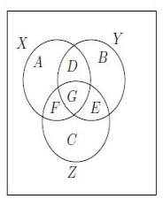{width="25%"}
    :::

    Which of the following options is (are) correct?

    1.  625 is in $E$.

    2.  $G$ is an empty set.

    3.  $A$ and $F$ are empty set.

    4.  25 is in $F$.

    \[Ans: (a), (c)\]

3.  Which of the following option(s) is(are) true for relation,
    $R_{1}=\left\{(x, y): x, y \in \mathbb{R}, x^{2}+y^{2}=1\right\}$

    1.  $R_{1}$ is a reflexive relation.

    2.  $R_{1}$ is a symmetric relation.

    3.  $R_{1}$ is a transitive relation.

    4.  $R_{1}$ is an equivalence relation.

    \[Ans: (b)\]

4.  Which of the following relations is/are one-one function?

    1.  $R_{1}=\{(x, y) \mid x, y \in \mathbb{R}, x+y>2\}$

    2.  $R_{2}=\{(x, y) \mid x, y \in \mathbb{R}, x>y\}$

    3.  $R_{3}=\{(x, y) \mid x, y \in \mathbb{R}, x+y=12\}$

    4.  $R_{4}=\left\{(x, y) \mid x, y \in \mathbb{R}, y=x^{2}\right\}$

    \[Ans: (c)\]

5.  Suppose that $L_{1}$ and $L_{2}$ are lines in the plane, with the
    $x$-intercepts of $L_{1}$ and $L_{2}$ are 2 and -1, respectively,
    and that the respective $y$-intercepts are -3 and 2. Choose the
    point where $L_{1}$ and $L_{2}$ intersect.

    1.  $(10,18)$

    2.  $(5,8)$

    3.  $(-10,-18)$

    4.  $(6,6)$

    \[Ans: (c)\]

6.  If $\theta$ is the angle between $L_{1}$ and $L_{2}$, then
    $\tan \theta$ is equal to

    1.  $\dfrac{1}{8}$

    2.  $\dfrac{1}{6}$

    3.  $\dfrac{3}{8}$

    4.  $\dfrac{1}{4}$

    \[Ans: (a)\]

7.  Consider two triangles $A B C$ and $P A B$ with coordinates
    $A(4,3), B(2,2)$, $C(8,3)$ and $P\left(t, t^{2}\right)$. The area of
    triangle $A B C$ is 4 times the area of the triangle $P A B$. What
    is the area of the triangle $A B C$?

    \[Ans: 2\]

8.  Choose all the possible options for $P$.

    1.  $(0, 0)$

    2.  $(2,4)$

    3.  $(-2, 4)$

    4.  $(-1, 1)$

    \[Ans: (d)\]

9.  Radhika has been tracking her monthly expenses and the corresponding
    number of outings she has with friends. Here's a table with two rows
    representing the amount spent on entertainment and the corresponding
    number of outings. Let's consider $y$ to be the amount spent and $x$
    to be the corresponding number of outings. She fitted a best-fit
    line to her data and obtained the equation $y=4 x+2$. What is the
    value of SSE (Sum of Squared Errors) in relation to the best-fit
    line?

    ::: center
         Amount spent      6   14   24   29   39   45
      ------------------- --- ---- ---- ---- ---- ----
       Number of outings   1   3    5    7    9    11
    :::

    \[Ans: 7\]

10. Let $l$ be the equation of line which passes through the point
    $(1,9)$ and parallel to $y=7 x+6$. Then which of the following are
    correct.

    1.  The slope of $l$ is 7.

    2.  The $y$-intercept of $l$ is 3.

    3.  The equation of line $l$ is $y=7 x+2$.

    4.  The $x$-intercept of $l$ is $\frac{1}{6}$.

    \[Ans: (a), (c)\]

11. If $x+a$ is one of the factors of $p(x)=k x^{2}+k a x+5 x+15$, then
    find the value of $a$.

    \[Ans: 3\]

12. Aman and Prakash want to solve a quadratic equation. Aman made a
    mistake in writing down the constant term and ended up in getting
    roots as 3 and 4. Prakash made a mistake in writing down the
    coefficient of $x$ and got the roots as 2 and 3. Consider the
    leading coefficient to be 1 in all cases. The correct roots of the
    quadratic equation are:

    1.  1 and 5

    2.  2 and 6

    3.  1 and 6

    4.  2 and 5

    \[Ans: (c)\]

13. Consider two polynomials $p(x)=x^{4}+3 x^{3}-9 x+8$ and
    $q(x)=\left(x^{2}+x\right)(x+3)$. Let $r(x)$ be the remainder
    obtained when $p(x)$ is divided by $q(x)$. Let $l(x)$ be the line
    that passes through the $y$-intercept and the minimum point in the
    graph of $r(x)$.

    Which of the following options is/are true?

    ::: center
    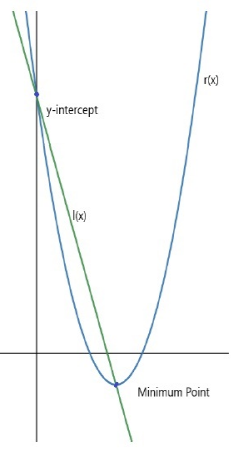{width="25%"}
    :::

    1.  $r(x)=-16 x^{2}+4 x-8$

    2.  $l(x) \equiv y=-3 x+8$

    3.  $l(x) \equiv y=-2 x+8$

    4.  The $p(x)$ has at most 4 turning points.

    \[Ans: (b)\]

14. Consider the three polynomials

    - $p(x)=4 x^{5}+9 x^{4}+b_{1} x^{2}+c_{1}$.

    - $q(x)=-5 x^{4}+8 x^{2}+b_{2} x+c_{2}$.

    - $s(x)=x^{7}+72 x^{5}+b_{3} x^{3}+c_{2} x^{2}+d_{3} x+e_{3}$.

    Which of the following options is/are true?

    1.  If $r_{1}(x)$ is the obtained remainder when $q(x)$ divides
        $p(x)+q(x)$, then the maximum possible degree of $r_{1}(x)$ is
        5.

    2.  If $r_{2}(x)$ is the obtained remainder when $p(x)$ divides
        $s(x)$, then the maximum possible degree of $r_{2}(x)$ is 2.

    3.  If $t_{1}(x)$ is the obtained quotient when $q(x)$ divides
        $p(x)$, then the possible degree of $t_{1}(x)$ is 1.

    4.  If $t_{2}(x)$ is the obtained quotient when $p(x)$ divides
        $s(x)$, then the possible degree of $t_{2}(x)$ is 3.

    \[Ans: (c)\]

15. Which of the following options is/are true?

    1.  $q(x) \rightarrow-\infty$ as $x \rightarrow \infty$.

    2.  $p(x) \rightarrow \infty$ as $x \rightarrow \infty$.

    3.  $q(x) \rightarrow \infty$ as $x \rightarrow \infty$.

    4.  $s(x) \rightarrow-\infty$ as $x \rightarrow \infty$.

    \[Ans: (a), (b)\]

# Quiz 2 Jan 25 {#quiz-2-jan-25 .unnumbered}

1.  Choose the set of correct options.

    1.  The function $f: \mathbb{R} \to \mathbb{R}$ such that
        $f(x) = -x^2 + \sqrt{x^2}$ is onto.

    2.  The function $f(x) = x^2 - 5x + 6$ is a one-one function.

    3.  The function $f(x) = e^{x+5}$ is one-one.

    4.  If $f$ is an invertible function, then $f^{-1}$ is a one-one
        function.

    \[Ans: (c)\]

2.  Let $f$ be a function whose domain is $[-5,7]$. If $g(x) = |2x + 5|$
    and $[a, b]$ denotes the largest interval which can be a domain for
    the composition function $(f \circ g)(x)$, then the value of $a + b$
    is

    \[Ans: -5\]

3.  Consider a function $f(x)$ defined as $f(x) = \frac{2x+4}{3x}$. If
    $g(x)$ is the inverse function of $f(x)$, then which of the
    following option(s) is (are) true?

    1.  $g(x) = \frac{2}{2x-3}$

    2.  $g(x) = \frac{4}{3x-2}$

    3.  $g'(1) = -12$

    4.  $g'(7) = -\frac{1}{12}$

    \[Ans: (b), (c)\]

4.  If $4m - n = 0$ then find the values of
    $\frac{16^m}{2^n} + \frac{27^n}{9^{6m}}$.

    \[Ans: 2\]

5.  If $b > 0$ and $4 \log_x b + 9\log_{b^{5}x} b = 1$, then the
    possible value(s) of $z$ is(are)

    1.  $6^{10}$

    2.  $6^9$

    3.  $6^{-5}$

    4.  $6^5$

    \[Ans: (a)\]

6.  Let functions $f(x) = \log(x^2)$, $g(x) = 2\log x$, and
    $h(x) = (\log x)^2$ respectively. Choose the set of correct options.

    1.  $f(g(x))$ is not an injective function in its domain.

    2.  The domain of $f(x)$ and $g(x)$ are equal.

    3.  $f(g(x))$ is an injective function in its domain.

    4.  The range of $h(x)$ and $g(x)$ are equal.

    \[Ans: (a)\]

7.  Choose the set of correct options.

    1.  $\log_5 2$ is a rational number

    2.  If $0<b<1$ and $0<x<1$ then $\log_bx>0$

    3.  If $\log_3 (\log_5 x) = 1$ then $x = 625$

    4.  If $0<b<1$ and $0<x<y$ then $\log_bx>\log_by$

    \[Ans: (b),(d)\]

8.  Suppose three distinct persons A, B and C are standing on the X-axis
    of the XY-plane (as shown in the figure M1-1) and the distance
    between B and A is same as the distance between C and B. The
    coordinates of A, B and C are $(\log_5 3, 0)$,
    $(\log_5(3^x-\frac{9}{2}), 0)$ and
    $(\log_5(3^{x} - \frac{9}{4}), 0)$ respectively. What is the
    distance between C and B?

    ::: center
    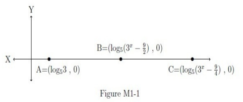{width="60%"}
    :::

    \[Ans: 0.24 to 0.26\]

9.  The value of
    $\lim_{x \to 0} \frac{(1+x)^\frac{1}{2} - (1-x)^\frac{1}{2}}{x}$ is:

    1.  $2/3$

    2.  $1/3$

    3.  $1$

    4.  $5/3$

    \[Ans: (c)\]

10. Find $\lim_{n \to \infty} a_n$ for the sequence $\{a_n\}$ such that
    $a_n = \frac{3^{n+2}-7n^3}{3^n+6n^3}$

    \[Ans: 9\]

11. Find $\lim_{n \to \infty} a_n$ for the sequence $\{a_n\}$ such that
    $a_n = \frac{2n+5(-1)^n}{4n-3(-1)^n}$

    \[Ans: 0.5\]

12. $f(x) = a \sin |x|+ be^{|x|}$ is differentiable at $x = 0$, if and
    only if

    1.  $a - b = 0$

    2.  $a = 0$

    3.  $a + b = 0$

    4.  $b = 0$

    \[Ans: (c)\]

13. Consider the function $f: \mathbb{R} \to \mathbb{R}$ defined by
    $f(x) = 
    \begin{cases}
    x^2-|x|& \text{if } x < 0, \\
    x^2+|x| & \text{if } x \geq 0.
    \end{cases}$

    Which of the following option(s) is (are) correct?

    1.  $f$ is not differentiable at $x = 0$.

    2.  $f$ is continuous at $x = 0$.

    3.  $f$ is differentiable at $x = 1$.

    4.  $f$ is not continuous at $x = 1$.

    \[Ans: (b), (c)\]

14. Let $f$ be a differentiable function at $x = 2$. The tangent line to
    the curve represented by the function $f$ at the point $(2,6)$
    passes through the point $(6, -18)$. What will be the value of
    $f'(2)$?

    \[Ans: -6\]

15. If $f(x) = g(x^2 + 7x) \times h(x^3+2x)$, $g'(0) = g(0) \neq 0$, and
    $h'(0) = h(0) \neq 0$, then find the value of $\frac{f'(0)}{f(0)}$

    \[Ans: 9\]

# End Term Jan 25 {#end-term-jan-25 .unnumbered}

1.  Which of the following statements is (are) correct?

    1.  $y-10=-3(x-20)^{2}$ is an equation of a parabola whose vertex is
        at $(10,20)$.

    2.  $p(x)=a x^{10}+b x^{7}+2 x+8$ where $a=0$ and $b \neq 0$, is a
        polynomial of degree 7.

    3.  $-4 x+5 y-1=0$ and $\frac{x}{4}+\frac{y}{5}-1=0$ are
        perpendicular to each other.

    4.  $x+5 y+9=0$ and $5 x+25 y+9=0$ are parallel to each other.

    \[Ans: (b), (c), (d)\]

2.  If $(a, b) \subset \mathbb{R}$ denotes the largest interval which
    can be a domain for the function
    $$f(x)=\log_{2}\left(1-\log_{2}\left(x^{2}-5 x+8\right)\right)$$
    then find the value of $a+b$.

    \[Ans: 5\]

3.  Evaluate $$\lim_{x \rightarrow 0} \frac{1-\cos x}{\sin x}$$

    \[Ans: 0\]

4.  Find $\lim_{n \rightarrow \infty} a_{n}$ for the sequence
    $\{a_{n}\}$ such that
    $$a_{n}=\frac{17 n^{3}+n^{2}-10 \sin(n)}{n^{3}+30 n}$$

    \[Ans: 17\]

5.  Find $\lim_{n \rightarrow \infty} a_{n}$ for the sequence
    $\{a_{n}\}$ such that $$a_{n}=\frac{1}{5}+\frac{(-1)^{n}}{n^{3}}$$
    Enter your answer correctly to two decimal places.

    \[Ans: 0.10 to 0.30\]

6.  Edwin plotted a graph on Desmos (an online graphing tool), which was
    continuous and differentiable at every point. Later he remembered
    the form of the function $f(x)$ that represents the graph that he
    plotted but forgot some of the values that appeared in the
    expression. So he used $m, n$, and $p$ in place of the missing
    values and the function he wrote down had the following expression:
    $$f(x)= \begin{cases}
    n e^{x}+3, & x<0 \\
    mx + 2, & x = 0 \\
    5x + p + 1, & x > 0
    \end{cases}$$

    Can you help Edwin by finding the values of $m, n$, and $p$?

    1.  $n=-1, p=1$

    2.  $n=1, p=1$

    3.  $n=1, p=-1$

    4.  $n=-1, p=-1$

    \[Ans: (a)\]

7.  Consider the function $f(x)=\cos x$. Let $L_{f}(x)$ be the linear
    approximation of the function at $x=\frac{1}{2}$. Is this statement
    True or False: The linear approximation
    $$L_{f}(x)=\cos\left(\frac{1}{2}\right)-\sin\left(\frac{1}{2}\right)\left(x-\frac{1}{2}\right)$$

    1.  TRUE

    2.  FALSE

    \[Ans: (a)\]

8.  The function $f(x)=2 x^{3}-24 x$ has a

    1.  local maximum at $x=-2$.

    2.  local minimum at $x=-2$.

    3.  local maximum at $x=2$.

    4.  local minimum at $x=2$.

    \[Ans: (a), (d)\]

9.  Find the value of $$\int_{0}^{\frac{\pi}{2}} f(x) dx$$ where
    $f(x)=\cos x$.

    \[Ans: 1\]

10. Is this statement True or False: $f(x)=\cos x$ has only finitely
    many critical points.

    1.  TRUE

    2.  FALSE

    \[Ans: (b)\]

11. Is this statement True or False: $f(x)=\cos x$ has local maxima at
    $x=0$.

    1.  TRUE

    2.  FALSE

    \[Ans: (a)\]

12. Suppose $G$ is a graph, as shown in the below figure. Let $V$ be the
    set of vertices of $G$, $V_{i}$ be the maximum independent set and
    $V_{c}$ be the minimum vertex cover. Which of the following is(are)
    true?

    ::: center
    :::

    1.  Cardinality of $V_{i}$ is 5.

    2.  Cardinality of $V_{c}$ is 4.

    3.  Cardinality of $V_{i}$ is 4.

    4.  Cardinality of $V_{c}$ is 3.

    \[Ans: (b), (c)\]

13. Consider the graph given below.

    ::: center
    :::

    Which of the following options is(are) correct?

    1.  If we perform Breadth-First Search at node 0, then one of the
        possible orders in which the nodes will be visited is 01246573.

    2.  If we perform Depth First Search at node 7, then one of the
        possible order in which the nodes will be visited is 74356012.

    3.  If we perform Breadth-First Search at node 0, then one of the
        possible orders in which the nodes will be visited is 01264537.

    4.  If we perform Depth First Search at node 0, then one of the
        possible orders in which the nodes will be visited is 76435012.

    \[Ans: (b), (c)\]

14. Which of the following options is true?

    1.  The cost of the spanning tree obtained by Prim's Algorithm is
        the same as obtained by Kruskal's Algorithm.

    2.  The minimum cost-spanning tree obtained by Prim's Algorithm is
        the same as obtained by Kruskal's Algorithm.

    3.  The minimum cost-spanning tree is not a tree.

    4.  If the weight of each edge in a graph is equal, then the total
        cost of the graph is equal to the cost of the minimum
        cost-spanning tree.

    \[Ans: (a)\]

15. Suppose Nitya wishes to find the minimum cost spanning tree of the
    graph given below. While finding the minimum cost spanning tree she
    finds that a few edge weights are missing ($x$ and $y$) but she is
    sure that the weight of the minimum cost spanning tree is 15 in the
    graph.

    ::: center
    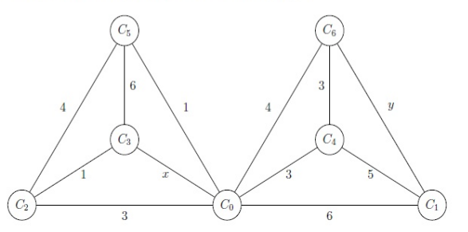{width="60%"}
    :::

    Which of the following are possible values for $x$ and $y$?

    1.  $x=4, y=3$

    2.  $x=2, y=6$

    3.  $x=3, y=4$

    4.  $x=1, y=6$

    \[Ans: (b), (c)\]

16. What is the minimum number of colors required to properly color the
    vertices of the given graph such that no two adjacent vertices share
    the same color?

    \[Ans: 4\]

:::: center
::: tcolorbox
**2024**
:::
::::

# Quiz 1 Sep 24 {#quiz-1-sep-24 .unnumbered}

1.  Suppose $A$ is the set of odd positive integers less than or equal
    to $20$, and $B$ is the set of positive integers less than or equal
    to $30$ which are divisible by $5$. Consider the following relations
    from $A$ to $B$:
    $R_1 = \{(a, b) \mid a \in A, b \in B, a \text{ is a factor of } b\}$
    $R_2 = \{(a, b) \mid a \in A, b \in B, (a + b) \bmod 15 = 0\}$ Which
    of the following statements are correct?

    1.  $(6, 14)$ is an element in $R_2$.

    2.  $R_2$ is not symmetric.

    3.  $R_1$ is transitive.

    4.  $R_2$ is reflexive.

    \[Ans: (b), (c)\]

2.  Which of the following options is/are true?

    1.  If $T$ is the set $\{a, b, c, d\}$, then cardinality of the set
        $T \times T$ is 16.

    2.  The minimum value of the quadratic expression
        $f(x) = 3x^2 - 18x + 20$ is -20.

    3.  For a quadratic equation $ax^2 + bx + c = 0$, where $a, b, c$
        are integers with $a \neq 0$ If $b^2 - 4ac > 0$ and a perfect
        square then there exists a rational root of the quadratic
        equation.

    4.  A line with an undefined slope is parallel to the Y-axis.

    \[Ans: (a), (c), (d)\]

3.  In a college of 500 students, 285 took Mathematics, 195 took
    Statistics, 115 took English, 70 took Mathematics and Statistics, 45
    took Mathematics and English, 50 took Statistics and English, and 10
    took all three courses. What is the total number of students who
    took none of these three subjects?

    \[Ans: 60\]

4.  Consider a set $S = \{a \mid a \in \mathbb{N}, a \leq 18\}$. Let
    $R_1$ and $R_2$ are relations on $S \times S$ defined as
    $R_1 = \{(x,y) \mid x, y \in S, y = 2x\}$ and
    $R_2 = \{(x,y) \mid x, y \in S, y = x^2\}$. Find the cardinality of
    the given sets in the subquestions.

    1.  $R_1$

        \[Ans: 10\]

    2.  $R_1 \cap R_2$

        \[Ans: 8\]

5.  You have been closely monitoring your bike's mileage recently. Here
    is a table showing two rows representing the amount paid for fuel
    (in currency units) and the corresponding mileage (in Km). Consider
    $y$ as the amount paid and $x$ as the corresponding mileage in Km.
    You noted the distance travelled each time the fuel meter falls back
    to a fixed reference mark and predicted that the best-fit line
    equation is $y = 4x + 1$. What will be the value of SSE with respect
    to the best-fit line?

    ::: center
       Amount paid (in currency units)   Distance (in Km)
      --------------------------------- ------------------
                     80                         20
                     60                         15
                     60                         16
                     100                        25
                     58                         14
    :::

    \[Ans: 29\]

6.  A bird is flying along the straight line $2y - 6x = 6$. After some
    time an aeroplane also follows the straight line path with a slope
    of 2 and passes through the point $(4, 8)$. Let $(\alpha, \beta)$ be
    the point where the bird and aeroplane can collide. Then find the
    value of $\alpha + \beta$.

    \[Ans: -9\]

7.  If $\alpha$ and $\beta$ are the roots of the equation
    $x^2 + 4x + 1 = 0$, then the equation whose roots are $\alpha^2$ and
    $\beta^2$ is:

    1.  $x^2 - 14x + 1 = 0$

    2.  $x^2 - 18x + 16 = 0$

    3.  $x^2 - 10x + 2 = 0$

    4.  $x^2 - 8x + 5 = 0$

    \[Ans: (a)\]

8.  Consider the polynomials $p(x) = x^3 - 3x^2 + 100x - 1$ and
    $q(x) = x^3 + x + 5$. Which of the following statements are correct?

    1.  $p(x) + q(x) \to \infty$ as $x \to -\infty$.

    2.  $p(x) - q(x) \to -\infty$ as $x \to \infty$.

    3.  $5p(x) \to \infty$ as $x \to -\infty$.

    4.  $\dfrac{1}{2}q(x) \to \infty$ as $x \to \infty$.

    \[Ans: (b)\]

9.  Consider a polynomial $p(x) = 0.3x^3(x^2 - 1)(x - 2)^2(x - 3)$ and
    the following figures.

    ::: center
    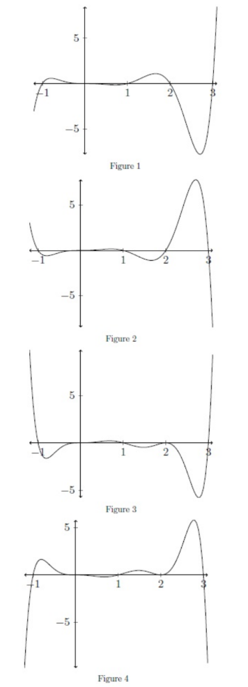{width="25%"}
    :::

    Which of the figures represents the polynomial $p(x)$?

    1.  Figure 1

    2.  Figure 2

    3.  Figure 3

    4.  Figure 4

    \[Ans: (c)\]

10. Consider the polynomial $p(x) = -(x + 4)^8(x - 4)^3(x + 12)^5$.
    Answer the given subquestions.

    1.  What is the degree of $p(x)$?

        \[Ans: 16\]

    2.  Calculate the number of turning points $p(x)$ can have?

        \[Ans: 3\]

# Quiz 2 Sep 24 {#quiz-2-sep-24 .unnumbered}

1.  **Use the following table for Questions 1 to 4**\
    Let $f(x)=\sqrt{x}$ and $g(x)=\sqrt{3-x}$.\
    \

              Composition of functions         Function                      Domain
      ------- -------------------------- ----- ----------------------- ----- ----------------
      i\)     $f \circ g$                a\)   $\sqrt{3-\sqrt{x}}$     1\)   $[0, \infty)$
      ii\)    $g \circ f$                b\)   $\sqrt[4]{x}$           2\)   $[-6,3]$
      iii\)   $f \circ f$                c\)   $\sqrt{3-\sqrt{3-x}}$   3\)   $(-\infty, 3]$
      iv\)    $g \circ g$                d\)   $\sqrt[4]{3-x}$         4\)   $[0,9]$

    \

2.  Choose the correct option from the following:

    1.  $i)-b)-3)$

    2.  $i)-c)-1)$

    3.  $i)-d)-2)$

    4.  $i)-d)-3)$

    \[Ans: (d)\]

3.  Choose the correct option from the following:

    1.  $ii)-a)-4)$

    2.  $ii)-b)-3)$

    3.  $ii)-c)-2)$

    4.  $ii)-d)-3)$

    \[Ans: (a)\]

4.  Choose the correct option from the following:

    1.  $iii)-b)-3)$

    2.  $iii)-b)-1)$

    3.  $iii)-d)-3)$

    4.  $iii)-c)-2)$

    \[Ans: (b)\]

5.  Choose the correct option from the following:

    1.  $iv)-c)-3)$

    2.  $iv)-a)-1)$

    3.  $iv)-c)-2)$

    4.  $iv)-b)-2)$

    \[Ans: (c)\]

6.  If $f(x)=x^{2}$ and $h(x)=x-1$, then which of the following options
    is(are) correct?

    1.  $f \circ h$ is a one-one function.

    2.  $f(f(h(x))) \times h(x)=(x-1)^{5}$.

    3.  There are three distinct solutions for $h(h(f(x)))=0$.

    4.  $h \circ f$ is a one-one function.

    \[Ans: (b)\]

7.  Consider the function $f(x)=|\log (x+1)|$. Choose the correct
    option(s) from the following.

    1.  The domain of $f$ is $(-1, \infty)$.

    2.  The domain of $f$ is $(-\infty, 1)$.

    3.  $f(x)$ is not a one-one function when $x \in(-1,1)$.

    4.  $f(x)$ is a one-one function when $x \in(-1,1)$.

    \[Ans: (a), (c)\]

8.  If $m^{\log _{3} 2}+2^{\log _{3} m}=8$, then what is the value of
    $m$?

    \[Ans: 9\]

9.  Find $\lim _{n \rightarrow \infty} a_{n}$ for the sequence
    $\left\{a_{n}\right\}$ such that
    $a_{n}=\frac{n^{5}-3 n^{3}+\sin (n)}{2 n^{5}+\ln (n)+n^{2}}$

    \[Ans: 0.5\]

10. Find $\lim _{n \rightarrow \infty} a_{n}$ for the sequence
    $\left\{a_{n}\right\}$ such that
    $a_{n}=\frac{e^{2 n}+n^{4}}{e^{3 n}+n^{5}}$

    \[Ans: 0\]

11. Consider the following function:
    $f(x)= \begin{cases}\frac{\sin (x)}{x}, & x \neq 0 \\ 1, & x=0\end{cases}$

    Which of the following option(s) is (are) true about $f(x)$?

    1.  $f$ is differentiable for all $x \in \mathbb{R}$.

    2.  $f$ is not differentiable at $x=0$.

    3.  $f$ is differentiable at $x=0$ and $f^{\prime}(0)=0$.

    4.  $f$ is differentiable at $x=0$ and $f^{\prime}(0)=1$.

    \[Ans: (a), (c)\]

12. Let $f$ be a polynomial of degree 5, which is given by
    $f(x)=a_{5} x^{5}+a_{4} x^{4}+a_{3} x^{3}+a_{2} x^{2}+a_{1} x+a_{0}$

    Let $f^{\prime}(b)$ denote the derivative of $f$ at $x=b$. Choose
    the set of correct options.

    1.  $a_{1}=f^{\prime}(0)$.

    2.  $5 a_{5}+3 a_{3}=\frac{1}{2}\left(f^{\prime}(1)+f^{\prime}(-1)-2 f^{\prime}(0)\right)$.

    3.  $4 a_{4}+2 a_{2}=\frac{1}{2}\left(f^{\prime}(1)-f^{\prime}(-1)\right)$.

    4.  $a_{1}=f^{\prime}(1)$.

    \[Ans: (a), (b), (c)\]

13. If the function
    $f(x)=\begin{cases}A x-B & \text { if } x \leq-1 \\ 2 x^{2}+3 A x+B & \text { if }-1 \leq x \leq 1 \\ 4 & \text { if } x > 1 \end{cases}$
    is continuous for all $x \in \mathbb{R}$, then find the value of
    $6(A+B)$.

    \[Ans: 3\]

14. Let $f$ be a differentiable function such that $f^{\prime}(9)=4$ and
    $f(9)=-14$. If $y=a x+b$ denotes the tangent of the function $f$ at
    $x=9$, then find the value of $a-b$.

    \[Ans: 54\]

# End Term Sep 24 {#end-term-sep-24 .unnumbered}

1.  Devendra has three sons (Jatin, Rabi, and Hem). Rabi has one son
    named Rathi. Hem has two sons (Avi and Manish). This family tree has
    been shown in the figure below.

    ::: center
    :::

    Let us define a relation R as follows,

    - R := {(A, B)\|A and B are first cousins, i.e, their parents are
      siblings}.

    - S := {(A, B)\|A is son of B}.

    Which of the following is (are) true?

    1.  R is an equivalence relation.

    2.  (Rathi, Rabi) $\in$ S but (Rabi, Rathi) $\notin$ S.

    3.  (Rathi, Hem) $\in$ R.

    4.  (Jatin, Devendra) $\in$ S but (Rathi, Devendra) $\notin$ S.

    \[Ans: (b), (d)\]

2.  Consider the three polynomials

    - $p(x) = 5x^5 + a_1x^4 + b_1x^2 + c_1$

    - $q(x) = -x^4 + a_2x^2 + b_2x + c_2$

    - $s(x) = -x^7 + a_3x^5 + b_3x^3 + c_2x^2 + d_3x + e_3$

    Which of the following options is/are true?

    1.  If $r1(x)$ is the obtained remainder when $q(x)$ divides $p(x)$,
        then the maximum possible degree of $r1(x)$ is 2.

    2.  If $r2(x)$ is the obtained remainder when $p(x)$ divides $s(x)$,
        then the maximum possible degree of $r2(x)$ is 2.

    3.  If $t1(x)$ is the obtained quotient when $q(x)$ divides $p(x)$,
        then the possible degree of $t1(x)$ is 3.

    4.  If $t2(x)$ is the obtained quotient when $p(x)$ divides $s(x)$,
        then the possible degree of $t2(x)$ is 2.

    \[Ans: (d)\]

3.  Which of the following option is true?

    1.  The maximum possible number of turning points of s(x) is 6.

    2.  The maximum possible number of turning points of p(x) is 5.

    3.  q(x) $\to \infty$ as x $\to \infty$.

    4.  s(x) $\to \infty$ as x $\to \infty$.

    \[Ans: (a)\]

4.  Find $\lim_{n \to \infty} a_n$ for the sequence $\{a_n\}$ such that
    $$\begin{align}
    a_n = \frac{11n^3 + 2n^2 - 1}{n^3 + 3n}
    \end{align}$$

    \[Ans: 11\]

5.  Find $\lim_{n \to \infty} a_n$ for the sequence $\{a_n\}$ such that
    $$\begin{align}
    a_n = \frac{1}{8} + \frac{(-1)^n}{n}
    \end{align}$$

    Enter your answer correctly to two decimal places.

    \[Ans: 0.12 to 0.13\]

6.  Consider the function f: $\mathbb{R} \to \mathbb{R}$ defined by
    $$\begin{align}
    f(x) =
    \begin{cases}
    x^2 - |x| & \text{if } x < 0, \\
    x^2 + |x| & \text{if } x \geq 0.
    \end{cases}
    \end{align}$$

    Which of the following option(s) is (are) correct?

    1.  f is not differentiable at x = 0.

    2.  f is continuous at x = 0.

    3.  f is differentiable at x = 1.

    4.  f is not continuous at x = 1.

    \[Ans: (b), (c)\]

7.  Suppose f is a real valued function defined on R. Let f(x+y) =
    f(x)f(y) for all x, y $\in$ R and f(1) = 7 and f'(0) = 2.

8.  What is the value of f(0)?

    \[Ans: 1\]

9.  What is the value of f'(1)?

    \[Ans: 14\]

10. Consider the function, $$\begin{align}
    f(x) = \frac{x^4}{4} + \frac{x^3}{3} - \frac{x^2}{2} -x
    \end{align}$$

11. Find the number of critical points of f(x).

    \[Ans: 2\]

12. Which of the following option(s) is(are) correct?

    1.  x = 1 is a point of local maxima.

    2.  x = 1 is a point of local minima.

    3.  The minimum value of the function is -11/12

    4.  The maximum value of the function is -11/12

    \[Ans: (b), (c)\]

13. Find the area of the region bounded by the function f(x) =
    3x$\sqrt{1 - x^2}$ and the lines x = 0, x = 1 and y = 0.

    \[Ans: 1\]

14. Consider the adjacency matrix of an undirected graph G:

    ::: center
    $\begin{pmatrix}
    0 & 1 & 0 & 1 & 0 \\
    1 & 0 & 1 & 0 & 1 \\
    0 & 1 & 0 & 1 & 1 \\
    1 & 0 & 1 & 0 & 1 \\
    0 & 1 & 1 & 1 & 0
    \end{pmatrix}$
    :::

    Which of the following option is/are true?

    1.  The Number of edges is 8.

    2.  The Number of vertices is 5.

    3.  The Number of edges is 7.

    4.  Each vertex has degree 3.

    \[Ans: (b), (c)\]

15. A company manufactures 10 chemicals x1, x2, x3, \.... x10. Certain
    pairs of these chemicals are incompatible and would cause explosions
    if brought into contact with each other. The below graph shows the
    incompatibility of the chemicals, each vertex represents the
    chemical and each edge between a pair of chemicals represents that
    those two chemicals are incompatible. As a precautionary measure,
    the company wishes to partition its warehouse into compartments and
    store incompatible chemicals in different compartments. What is the
    least number of compartments into which the warehouse should be
    partitioned?

    ::: center
    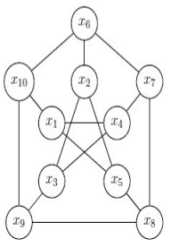{width="32%"}
    :::

    \[Ans: 3\]

16. Consider the following graph G.

    ::: center
    :::

    Which of the following is(are) not spanning tree of G?

    1.  
    2.  
    3.  
    4.  

    \[Ans: (a), (c)\]

17. A directed graph G is shown below. Suppose we are trying to perform
    an algorithm to find the shortest path from vertex v0 to v4. Which
    of the following statements is (are) correct?

    ::: center
    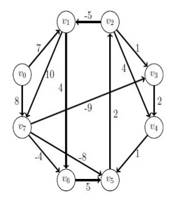{width="40%"}
    :::

    1.  Dijkstra's algorithm can be used to find the shortest path from
        v0 to v4.

    2.  Bellman-Ford algorithm can be used to find the shortest path
        from v0 to v4 because there are negative weighted edges.

    3.  The weight of the shortest path from v0 to v4 is 1.

    4.  Bellman-Ford algorithm cannot be used to find the shortest path
        from v0 to v4 because there is a negative cycle in the given
        graph.

    \[Ans: (d)\]

18. What is the weight of a minimum cost spanning tree of the given
    graph?

    ::: center
    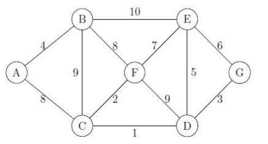{width="60%"}
    :::

    \[Ans: 23\]

# Quiz 1 May 24 {#quiz-1-may-24 .unnumbered}

1.  Suppose A is the set of even positive integers less than or equal to
    20 and B is the set of positive integers less than 20 which are
    divisible by 6. Consider the following relations from A to B.

    - $R_1 = \{(a,b) \mid a \in A, b \in B, a \text{ is a factor of b}\}$

    - $R_2 = \{(a,b) \mid a \in A, b \in B, (a + b) \mod 10 = 0\}$

2.  What is the cardinality of $R_1 \cap R_2$?

    \[Ans: 1\]

3.  What is the cardinality of $R_1$?

    \[Ans: 9\]

4.  Which of the following statements are correct?

    1.  $R_1$ is transitive.

    2.  $R_2$ is transitive.

    3.  $R_2$ is not symmetric.

    4.  $(2,18)$ is an element in $R_2$.

    \[Ans: (a), (c), (d)\]

5.  A company opened recruitment for the post of data analyst. 500
    candidates have applied for the post. 285 candidates are proficient
    in Python programming, 195 candidates are proficient in C
    programming, 115 candidates are proficient in Java programming, 45
    candidates are proficient in Python and Java, 70 candidates are
    proficient in C and Python, 50 candidates are proficient in C and
    Java and 50 candidates don't know any of the programming languages.
    Find the number of candidates who are proficient in exactly one of
    the three programming languages.

    \[Ans: 325\]

6.  Suppose that $P_1$ and $P_2$ are two different points in a Cartesian
    coordinate system, with $P_1$ located at $(3,-2)$ and $P_2$ at
    $(-1, 5)$. Let $L_1$ and $L_2$ be lines passing through $P_1$ and
    $P_2$ respectively. If the $x$-intercept of the line $L_1$ is $1$
    and the angle between $L_1$ and $L_2$ is $\frac{\pi}{2}$, then
    determine the coordinates of the point where $L_1$ and $L_2$
    intersect.

    1.  $(\frac{5}{2}, \frac{7}{2})$

    2.  $(5,11)$

    3.  $(-5,7)$

    4.  $(\frac{-5}{2}, \frac{7}{2})$

    \[Ans: (d)\]

7.  If the $x$-intercept of the line $L_1$ is 1 and $y$-intercept of the
    line $L_2$ is -1 and if $\theta$ is the angle between $L_1$ and
    $L_2$, then $\tan \theta$ is equal to

    1.  $-\frac{5}{7}$

    2.  $\frac{5}{7}$

    3.  $\frac{5}{3}$

    4.  $\frac{4}{7}$

    \[Ans: (b)\]

8.  Radhika has been tracking her monthly expenses and the corresponding
    number of outings she has with friends. Here's a table with two rows
    representing the amount spent on entertainment and the corresponding
    number of outings. Let's consider $y$ to be the amount spent and $x$
    to be the corresponding number of outings. She fitted a best fit
    line to her data and obtained the equation $y = 4x + 15$. What is
    the value of SSE (Sum of Squared Errors) in relation to the best fit
    line?

    ::: center
         Amount spent      37   44   53   50   57   64
      ------------------- ---- ---- ---- ---- ---- ----
       Number of outings   5    7    9    8    10   12
    :::

    \[Ans: 23\]

9.  Consider the parabola $y = x^2 + 4x + 12$. Which of the following
    option(s) are true?

    1.  The co-ordinates of vertex is $(-8, 2)$.

    2.  The given equation attains its minima at $x = -2$.

    3.  $y$-intercept of parabola is 12.

    4.  The minimum value for the given equation is 8.

    \[Ans: (b), (c), (d)\]

10. Consider the quadratic equation $ax^2 + bx + c = 0$ where $a, b, c$
    are integers with $a \neq 0$. Which of the following option(s) are
    true?

    1.  If $b^2 - 4ac > 0$ and a perfect square then there exists a
        rational root of the quadratic equation.

    2.  If $b^2 - 4ac > 0$ and not a perfect square then there exists a
        rational root of the quadratic equation.

    3.  If $b^2 - 4ac < 0$ and a perfect square then there exists a
        rational root of the quadratic equation.

    4.  If $b^2 - 4ac < 0$ and not a perfect square then there exists a
        rational root of the quadratic equation.

    \[Ans: (a)\]

11. Consider the following polynomial $p(x)$ whose graph is given below:

    ::: center
    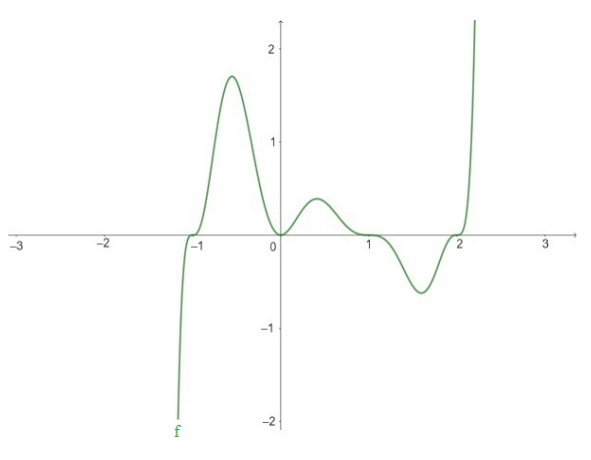{width="60%"}
    :::

    1.  Multiplicity of -1 and 1 must be the same.

    2.  p(x) is an increasing function in the interval $(2,\infty)$.

    3.  p(x) tends to infinity as x tends to infinity.

    4.  The number of turning points is 5

    \[Ans: (b), (c)\]

12. Consider the polynomials $p(x) = (2x - 1)(x-5)q(x)$ where the zeros
    of $p(x)$ with multiplicity 1 are $\frac{1}{2}, 5, 2, \frac{3}{5}$.
    Which of the following option(s) are true for $q(x)$?

    1.  $q(x)$ is a cubic polynomial.

    2.  $q(x)$ is a quadratic polynomial.

    3.  $q(x)$ has two distinct zeros.

    4.  $q(x)$ does not have any real zeros.

    \[Ans: (b), (c)\]

# Quiz 2 May 24 {#quiz-2-may-24 .unnumbered}

1.  Which of the following statements is/are true about the function
    $f(x)=|x^{2}-4x+3|+17$?

    1.  $f$ is defined only for all $x \in \mathbb{N}$.

    2.  $f$ is a bijective function.

    3.  The range of $f$ is $[0, \infty)$.

    4.  The minimum value of $f$ is 17.

    \[Ans: (d)\]

2.  Which of the following statements is/are true about the function
    $f(x)=|x^{2}-4x+3|+17$?

    1.  $f$ is defined only for all $x \in \mathbb{N}$.

    2.  $f$ is a bijective function.

    3.  The range of $f$ is $[0, \infty)$.

    4.  The minimum value of $f$ is 17.

    \[Ans: (d)\]

3.  Find the domain of the inverse function of $y=x^{3}-1$.

    1.  $\mathbb{R}$

    2.  $\mathbb{R} \backslash\{1\}$

    3.  $[1, \infty)$

    4.  $\mathbb{R} \backslash[1, \infty)$

    \[Ans: (a)\]

4.  Choose the set of correct options.

    1.  If $0 < b < 1$ and $0 < x < 1$ then $\log_{b}x<0$

    2.  If $0 < b < 1, 0 < x < 1$ and $x > b$ then $\log_bx> 1$

    3.  If $0 < b < 1$ and $0 < x < y$ then $log_bx > log_by$

    4.  $\log_{10}100$ is a rational number.

    \[Ans: (c), (d)\]

5.  If $m^{\log_{3}2}+2^{\log_{3}m}=8$, then what is the value of $m$?

    \[Ans: 9\]

6.  If $f(x)=\sqrt{9-x^{2}}$, then find out the value of
    $\sqrt{5} \times \lim_{x \rightarrow 2} \frac{f(x)-f(2)}{x-2}$.

    \[Ans: -2\]

7.  Calculate the limit of the following function: $$f(x)= \begin{cases}
    x^{2}-2x+4 & x \geq 0 \\
    e^{x^{2}}+3 & x < 0
    \end{cases}$$ at $x=0$.

    \[Ans: 4\]

8.  Calculate the limit of the following function:
    $$f(x)=\frac{x^{4}-3x^{3}+2}{x^{4}-5x^{3}+3x^{2}+1}$$ at $x=1$

    \[Ans: 1\]

9.  Find the limit of the following sequence: $$\{a_{n}\}$$ such that
    $$a_{n}=\frac{6+6 \cdot 2^{2}+6 \cdot 3^{2}+\ldots+6 \cdot n^{2}}{\sqrt{4n^{6}+5}}$$

    \[Ans: 1\]

10. Find the limit of the following sequence: $$\{a_{n}\}$$ such that
    $$a_{n}=\frac{100n^{2}-11}{100n^{3}+7}$$

    \[Ans: 0\]

11. Consider the graphs given below:

    ::: center
    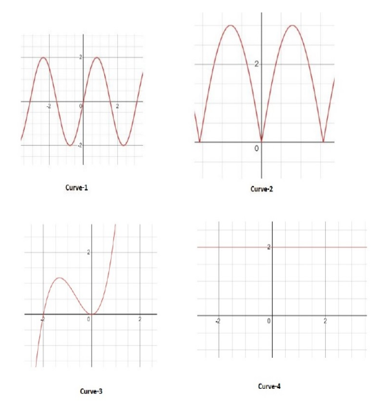{width="100%"}
    :::

    Choose the set of correct options:

    1.  There are at least two points between -4 and 4, where the
        derivatives of the function corresponding to Curve 1, are equal.

    2.  At the origin the derivative of the function corresponding to
        Curve 2 does not exist.

    3.  The derivative of the function corresponding to Curve 3, at the
        origin and point $(-2,0)$ are equal.

    4.  The derivative of the function corresponding to Curve 4 does not
        exist at any point.

    \[Ans: (a), (b)\]

12. Consider the function: $$f(x)= \begin{cases}
    [x+1] & -3 \leq x < 0 \\
    0 & x = 0 \\
    \{x+1\} & 0 < x \leq 3
    \end{cases}$$

    where $[.]$ is the greatest integer function (floor function) and
    $\{.\}$ is the fractional part function.

    Is the statement True or False: The left-hand limit (LHL) and
    right-hand limit (RHL) of the given function $f(x)$ exist at $x=0$
    and are equal to each other.

    1.  TRUE

    2.  FALSE

    \[Ans: (a)\]

13. Is the statement True or False: The function $f(x)$ is continuous at
    $x=0$.

    1.  TRUE

    2.  FALSE

    \[Ans: (a)\]

14. Find the total number of points in $[-3,3]$ at which $f(x)$ is not
    continuous.

    \[Ans: 5\]

15. Consider the function: $$f(x)=4x^{5}+x^{2}|x+1|+x+5$$

    Is the statement True or False: Left-hand derivative (LHD) and
    Right-hand derivative (RHD) of the function $f(x)$ exist and are
    equal to each other at $x=-1$.

    1.  TRUE

    2.  FALSE

    \[Ans: (b)\]

16. Is the statement True or False: The function $|x+1|f(x)$ is
    continuous at $x=-1$.

    1.  TRUE

    2.  FALSE

    \[Ans: (a)\]

17. Is the statement True or False: The derivative of the function $f$
    at $x=0$ is 1.

    1.  TRUE

    2.  FALSE

    \[Ans: (a)\]

18. Is the statement True or False: Let $L(x)$ be the linear
    approximation to $f(x)=xe^{x}-1$ at the point $a$ such that
    $f(a)=L(a)$ and the slope of the graph of $L$ is $f^{\prime}(a)$.
    Then $L(x)=e^{a}(a+1)x-a^{2}e^{a}-1$.

    1.  TRUE

    2.  FALSE

    \[Ans: (a)\]

19. Let $f$ be a differentiable function at $x=3$. The tangent line to
    the graph of the function $f$ at the point $(3,0)$, passes through
    the point $(5,4)$. What will be the value of $f^{\prime}(3)$?

    \[Ans: 2\]

# End Term May 24 {#end-term-may-24 .unnumbered}

1.  Consider the following relations defined on the set of integers

    - $R_1 = \{(x, y)|x, y \in \mathbb{Z} \text{ and } 7 \text{ divides } (x - y)\}$

    - $R_2 = \{(x,y)|x, y \in \mathbb{Z} \text{ and } x + y = 2\}$

    Choose the correct option(s).

    1.  $R_1$ is not transitive.

    2.  $R_2$ is symmetric.

    3.  $R_1$ is symmetric.

    4.  $R_2$ is transitive.

    \[Ans: (b), (c)\]

2.  You have been closely monitoring your bike's mileage recently. Here
    is a table showing two rows representing the amount paid for fuel(in
    Rs.) and the corresponding mileage (in Km). Consider y as the amount
    paid and z as the corresponding mileage in Km. You have noted down
    the distance traveled each time when the fuel meter falls back to a
    fixed reference mark and predicted that the equation of the best fit
    line is $y = 5x - 21$. What will be the value of SSE w.r.t the best
    fit line?

    ::: center
       Amount paid (in Rs)   80   50   60   100   48
      --------------------- ---- ---- ---- ----- ----
        Distance (in Km)     20   15   16   25    14
    :::

    \[Ans: 35\]

3.  Points $A(4,3)$, $B(-3,-4)$ and $C(m, n)$ are collinear. If points
    $D(-1, 2)$, $E(5, -4)$ and $C$ are also collinear, the value of
    $\frac{4m+9n}{2m + 3n}$ is.

    \[Ans: 2\]

4.  Which of the following statements is/are true about the function
    $f(x) = x^2+2x - 8$?

    1.  $f$ is one-one on its domain.

    2.  $f$ has an inverse on its domain.

    3.  The vertex of this parabola is at $(-1, -9)$.

    4.  y-intercept of the given parabola is $-8$.

    \[Ans: (c), (d)\]

5.  Consider two polynomials $p(x) = -x^5 + 5x^4 - 7x - 2$ and
    $q(x) = -x^5 + 5x^4 - x^3 - 2$. Which of the following options
    is/are true?

    1.  $p(x)$ and $q(x)$ intersect at two points.

    2.  $p(x) \to \infty$ as $x \to \infty$.

    3.  $p(x)$ has 5 turning points.

    4.  $q(x) \to -\infty$ as $x \to \infty$.

    \[Ans: (a), (d)\]

6.  Consider the functions $f(x) = \sqrt{x + 4}$ and
    $g(x) = \log(1+x^2)$. Which of the following options is/are true?

    1.  $(f \circ g)(x) = \log (2x + 5)$ on its domain of definition.

    2.  The domain of the function $(g \circ f)(x)$ is $(-5, \infty)$.

    3.  The domain of the function $(g \circ f)(x)$ is $[-6, -1]$.

    4.  $(g \circ f)(x) = \log (x + 5)$ on its domain of definition.

    \[Ans: (d)\]

7.  Choose the correct option(s).

    1.  $\lim_{x \to 0} [x \times \sin(1/x)] = 0$

    2.  $\lim_{x \to 0} \frac{e^{1/x}}{e^{1/x} + 1} = 0$

    3.  $\lim_{x \to 0} [x \times \sin(1/x)] = 1$

    4.  $\lim_{x \to 0} \frac{e^{1/x}}{e^{1/x} + 1} = 1$

    \[Ans: (a)\]

8.  Consider the following function: $$f(x) = 
    \begin{cases} 
    \frac{x}{(x+1)(x+2)}, & x \geq 1 \\
    \frac{1}{x-5}, & x < 1
    \end{cases}$$

    Which of the following options is (are) correct?

    1.  $\lim_{x \to -2^+} f(x) = \infty$

    2.  The function $f$ is continuous.

    3.  $\lim_{x \to 5^+} f(x) = \lim_{x \to 5^-} f(x) = \frac{5}{42}$

    4.  At $x = 1$, the function $f$ is discontinuous.

    \[Ans: (c), (d)\]

9.  Consider the following functions:

    - $v(t) = 4t^2 + 2t$

    - $s(t) = 20 + 4t - t^2$

    Let $[.]$ be the floor function (greatest integer function), e.g.,
    $[2.34] = 2$, $[5] = 5$.

    If A and B are the areas under the curves $v(t)$ and $s(t)$
    respectively, from $t = 0$ to $t=1$ then what is the value of
    $[A] + [B]$.

    \[Ans: 23\]

10. If $\alpha$ and $\beta$ are the Y-coordinates of the points of
    intersection of the curves $v(t)$ and $s(t)$ then what is the value
    of $10(\alpha + \beta)$.

    \[Ans: 4\]

11. Consider the following adjacency matrix

            A B C D E
        A   0 1 0 1 1
        B   1 0 1 0 1
        C   0 1 0 0 1
        D   1 0 0 0 1
        E   1 1 1 1 0

    which represents graph G which has 5 vertices A, B, C, D and E.
    Which of the following is true about the graph G?

    1.  The number of vertices in G of degree 3 are 3.

    2.  The total number of edges in G are 7.

    3.  The total number of edges in G are 14.

    4.  There is a cycle in G.

    \[Ans: (b), (d)\]

12. What is the minimum number of colours required to colour the graph
    given below?

    ::: center
    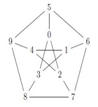{width="30%"}
    :::

    \[Ans: 3\]

13. Suppose we obtain the following BFS tree rooted at node A for an
    undirected graph with vertices $\{A, B, C, D, E, F, G\}$.

    ::: center
    :::

    Which of the following cannot be an edge in the original graph?

    1.  $(A,D)$

    2.  $(E,C)$

    3.  $(D,G)$

    4.  $(B,F)$

    \[Ans: (a)\]

14. Which of the following is (are) correct?

    1.  Floyd-Warshall algorithm is used for all pair shortest paths.

    2.  The Shortest path problem is not applicable to a graph with a
        negative weight cycle.

    3.  Bellman-Ford algorithm is used for single source shortest path.

    4.  Dijkstra's algorithm is used for all pair shortest paths.

    \[Ans: (a), (b), (c)\]

15. Consider a weighted graph G with 7 vertices (rows and columns are in
    the order $V_1, V_2, V_3, V_4, V_5, V_6, V_7$), which is represented
    by the following adjacency matrix:

    $$\begin{bmatrix}
    0 & 24 & 0 & 0 & 36 & 0 & 28 \\
    24 & 0 & 0 & 32 & 0 & 0 & 0 \\
    0 & 0 & 0 & 0 & 0 & 4 & 12 \\
    0 & 32 & 0 & 0 & 8 & 0 & 0 \\
    36 & 0 & 0 & 8 & 0 & 0 & 0 \\
    0 & 0 & 4 & 0 & 0 & 0 & 20 \\
    28 & 0 & 12 & 0 & 0 & 20 & 0 \\
    \end{bmatrix}$$

    Suppose we perform Prim's algorithm on the graph G starting from
    vertex $V_1$ to find an MCST. Then the order in which the vertices
    are added is:

    1.  $V_1, V_3, V_6, V_7, V_2, V_4, V_5$

    2.  $V_1, V_2, V_7, V_3, V_6, V_4, V_5$

    3.  $V_1, V_2, V_4, V_5, V_7, V_3, V_6$

    4.  $V_1, V_3, V_6, V_7, V_5, V_4, V_2$

    \[Ans: (b)\]

16. Find the value of MCST.

    \[Ans: 108\]

# Quiz 1 Jan 24 {#quiz-1-jan-24 .unnumbered}

1.  Consider the following relations defined on the set of integers:

    - $R_{1}=\{(x, y): x, y \in \mathbb{Z}$ and $|x-y| \leq 3\}$.

    - $R_{2}=\{(x, y): x, y \in \mathbb{Z}$ and 3 divides $x-y\}$.

    Choose the correct option(s):

    1.  $R_{1}$ is reflexive and symmetric.

    2.  $R_{2}$ is symmetric but not transitive.

    3.  $R_{1}$ is an equivalence relation but $R_{2}$ is not an
        equivalence relation.

    4.  $R_{2}$ is an equivalence relation but $R_{1}$ is not an
        equivalence relation.

    \[Ans: (a), (d)\]

2.  Let $f(x)=|x^{2}-4|-1$. Which of the following option(s) are true
    for $f$?

    1.  $f$ is defined for all $x \in \mathbb{R}$.

    2.  $f$ is one-one.

    3.  The range of $f$ is $[-1, \infty)$.

    4.  The minimum value of $f$ is 0.

    \[Ans: (a), (c)\]

3.  In a grocery store, 60 customers made a purchase on a specific day.
    28 people bought bread, 37 people bought milk and 30 people bought
    fruits. All the customers bought at least one of the three items. 16
    of them bought bread and fruits, 17 of them bought bread and milk
    and 9 of them bought all the three items.

    Based on the above data, answer the given subquestions.

4.  Find the number of customers who bought milk and fruits.

    \[Ans: 11\]

5.  Find the number of customers who bought milk and fruits but not
    bread.

    \[Ans: 2\]

6.  Consider two triangles $ABC$ and $PAB$ with coordinates
    $A(4,3), B(2,2), C(8,3)$ and $P(t, t^{2})$. The area of triangle
    $ABC$ is 4 times the area of the triangle $PAB$.

    Based on the above data, answer the given subquestions.

7.  What is the area of the triangle $ABC$?

    \[Ans: 2\]

8.  Choose all the possible options for $P$.

    1.  $(0, 0)$

    2.  $(2,4)$

    3.  $(-2, 4)$

    4.  $(-1, 1)$

    5.  $(1, 1)$

    \[Ans: (d), (e)\]

9.  Suppose that $L_{1}$ and $L_{2}$ are lines in the plane, with the
    $x$-intercepts of $L_{1}$ and $L_{2}$ are 2 and -1, respectively,
    and that the respective $y$-intercepts are -3 and 2.

    Based on the above data, answer the given subquestions.

10. Choose the point where $L_{1}$ and $L_{2}$ intersect.

    1.  $(10,18)$

    2.  $(5,8)$

    3.  $(-10,-18)$

    4.  $(6,6)$

    \[Ans: (c)\]

11. If $\theta$ is the angle between $L_{1}$ and $L_{2}$, then
    $\tan \theta$ is equal to

    1.  $\frac{1}{8}$

    2.  $\frac{1}{6}$

    3.  $\frac{3}{8}$

    4.  $\frac{1}{4}$

    \[Ans: (a)\]

12. Which of the following options is/are true?

    1.  The point at which the slope of the equation $x^{2}+2x-5$ equals
        10 is $(4,17)$

    2.  $x=2$ is the axis of symmetry of the quadratic function
        $f(x)=x^{2}+4x+5$

    3.  If two different quadratic equations have same discriminant then
        the roots of both equations can be same.

    4.  The point at which the slope of the equation $x^{2}+2x-5$ equals
        10 is $(4,19)$

    \[Ans: (c), (d)\]

13. If the slope of parabola $y=Ax^{2}+Bx+C$, where
    $A, B, C \in \mathbb{R}$ at points $(3,2)$ and $(2,3)$ are 16 and 12
    respectively.

    Based on the above data, answer the given subquestions.

14. Calculate the value of $A$

    \[Ans: 2\]

15. Calculate the value of $B$

    \[Ans: 4\]

16. Ram and Shyam want to solve a quadratic equation. Ram made a mistake
    in writing down the constant term and ended up in getting roots as 3
    and 4. Shyam made a mistake in writing down the coefficient of $x$
    and got the roots as 2 and 3. Consider the leading coefficient to be
    1 in all cases. The correct roots of the quadratic equation are:

    1.  1 and 5

    2.  2 and 6

    3.  1 and 6

    4.  2 and 5

    \[Ans: (c)\]

17. Consider two polynomials $p(x)=-x^{5}+5x^{4}-7x-2$ and
    $q(x)=-x^{5}+5x^{4}-x^{2}-2$. Which of the following options is/are
    true?

    1.  $q(x) \longrightarrow \infty$ as $x \longrightarrow \infty$.

    2.  $p(x) \longrightarrow -\infty$ as $x \longrightarrow \infty$.

    3.  $p(x)$ has at most 4 turning points.

    4.  The quotient obtained while dividing $q(x)$ by $p(x)$ is a
        constant.

    \[Ans: (b), (c), (d)\]

18. Consider the following polynomial $p(x)$ whose graph is given below:

    ::: center
    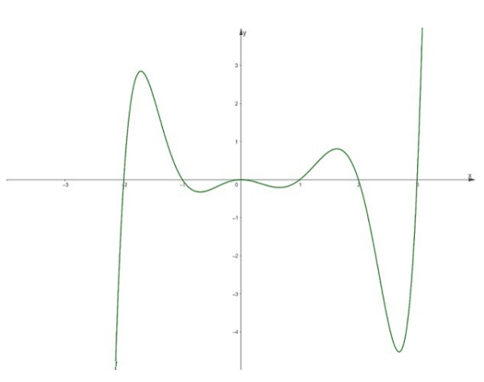{width="60%"}
    :::

    Which of the following options is/are correct.

    1.  Multiplicity of -1 and 1 must be same.

    2.  $p(x)$ is increasing in the interval $(3, \infty)$.

    3.  The total number of local minima is 3.

    4.  The number of turning points is 5.

    \[Ans: (b), (c)\]

# Quiz 2 Jan 24 {#quiz-2-jan-24 .unnumbered}

1.  Choose the correct option(s) from the following:

    1.  If $g$ is an even function, then $f \circ g$ is always an even
        function.

    2.  If $f$ is an invertible increasing function, then $f^{-1}$ is a
        decreasing function.

    3.  The function $f: \mathbb{N} \rightarrow \mathbb{N}$ given by
        $f(0)=f(1)=f(2)=1$ and $f(x)=x-1$ for $x \geq 3$ is onto but not
        one-one.

    4.  There exists a function $g$ which is not one-one and a function
        $f$ which is one-one such that $f \circ g$ is one-one.

    \[Ans: (a), (c)\]

2.  Find the number of solution(s) of the equation $9^{x}+3^{x}-6=0$.

    \[Ans: 1\]

3.  Let $f(x)=\sqrt{x}$ and $g(x)=\sqrt{3-x}$.

    ::: center
              Composition of functions         Function                      Domain
      ------- -------------------------- ----- ----------------------- ----- ----------------
      i\)     $f \circ g$                a\)   $\sqrt{3-\sqrt{x}}$     1\)   $[0, \infty)$
      ii\)    $g \circ f$                b\)   $\sqrt[4]{x}$           2\)   \[-6,3\]
      iii\)   $f \circ f$                c\)   $\sqrt{3-\sqrt{3-x}}$   3\)   $(-\infty, 3]$
      iv\)    $g \circ g$                d\)   $\sqrt[4]{3-x}$         4\)   \[9\]
    :::

    From the above table, answer the given subquestions.

4.  Choose the correct option from the following:

    1.  i)-b)-3)

    2.  i)-c)-1)

    3.  i)-d)-2)

    4.  i)-d)-3)

    \[Ans: (d)\]

5.  Choose the correct option from the following:

    1.  ii)-a)-4)

    2.  ii)-b)-3)

    3.  ii)-c)-2)

    4.  ii)-a)-3)

    \[Ans: (a)\]

6.  Choose the correct option from the following:

    1.  iii)-b)-3)

    2.  iii)-b)-1)

    3.  iii)-d)-3)

    4.  iii)-c)-2)

    \[Ans: (b)\]

7.  Choose the correct option from the following:

    1.  iv)-c)-3)

    2.  iv)-a)-1)

    3.  iv)-c)-2)

    4.  iv)-b)-2)

    \[Ans: (c)\]

8.  Let
    $f(x)= \begin{cases}-\left|x^{2}-1\right| & x<a \\ \sqrt{x+2} & x \geq a\end{cases}$

    Based on the above data, answer the given subquestions.

9.  Find the smallest value of $a$ such that the function $f$ is defined
    for all real numbers.

    \[Ans: -2\]

10. Find the largest value of $a$ such that the function $f$ is defined
    for all real numbers and satisfies the horizontal line test.

    \[Ans: -1\]

11. Find the number solution(s) of the equation
    $\ln (7)+\ln \left(2-4 x^{2}\right)=\ln (14)$.

    \[Ans: 1\]

12. If $f(x)=\sqrt{9-x^{2}}$, then find out the value of
    $8 \sqrt{8} \times \lim _{x \rightarrow 1} \frac{f(x)-f(1)}{x-1}$.

    \[Ans: -8\]

13. Consider the function $f(x)=\frac{2 x^{2}}{|x|}$. Then
    $\lim _{x \rightarrow 0} f(x)$ is

    \[Ans: 0\]

14. Find the limits of the given sequences in the subquestions.

15. $\left\{a_{n}\right\}$ such that
    $a_{n}=\frac{100 n^{2}-11}{100 n^{3}+7}$

    \[Ans: 0\]

16. Evaluate the following limit:
    $$\lim _{x \rightarrow 2} \frac{x^{6}-24 x-16}{x^{3}+2 x-12}$$

    \[Ans: 12\]

17. Choose the set of correct options.

    1.  If a function is continuous at a particular point, then the
        function is differentiable at that point.

    2.  If a function is differentiable at a particular point, then the
        function must be continuous at that point.

    3.  If $f(x)$ is differentiable at the point $a$, then $c f(x)$ is
        differentiable at the point $a$, for all $c \in \mathbf{R}$, and
        $(c f)^{\prime}(a)=c f^{\prime}(a)$.

    4.  If $f(x)$ and $g(x)$ are differentiable functions, then
        $|(f+g)(x)|$ is also a differentiable function.

    \[Ans: (b), (c)\]

18. Consider the function
    $$f(x)= \begin{cases}\frac{3 x}{(x+2)^{2}} & x \leq-1 \\ 2 x-5 & -1 < x \leq1\\ \frac{-8}{x+1} & x > 1\end{cases}$$

    Find the total number of points in $(-2,2)$ at which $f(x)$ is not
    continuous.

    \[Ans: 2\]

19. Let $f$ be a differentiable function such that $f^{\prime}(4)=1$ and
    $f(4)=-3$. If $y=a x+b$ denotes the tangent of the function $f$ at
    $x=4$ then find the value of $b$.

    \[Ans: -7\]

# End Term Jan 24 {#end-term-jan-24 .unnumbered}

1.  Suppose $A=\{a, b, c, d\}$ and $B=\{p, q, r, s\}$ are two sets.
    Consider the following relations on $A \times B$.

    - $R_{1}=\{(a, p),(c, r),(d, q)\}$

    - $R_{2}=\{(a, s),(b, s),(c, p),(d, r)\}$

    - $R_{3}=\{(a, p),(b, r),(b, s),(d, q)\}$

    - $R_{4}=\{(a, r),(b, p),(c, q),(d, s)\}$

    Which of the following statements are correct?

    1.  $R_{2}, R_{3}$, and $R_{4}$ are functions.

    2.  $R_{2}$ and $R_{4}$ are functions.

    3.  $R_{2}$ is an injective function.

    4.  $R_{4}$ is a bijective function.

    \[Ans: (b), (d)\]

2.  A person is climbing stairs and he stops at a point $P$ on the
    stairs after reaching two-third of the total distance of stairs. The
    stairs forms an isosceles triangle with the floor and wall. Assume
    the origin $(0,0)$ at the intersection of the wall and floor and the
    stairs is to the right of the wall.

    Based on the above data, answer the given subquestions.

3.  Find the angle between the stairs and the wall (in degrees).

    \[Ans: 45\]

4.  If the distance between the bottom of the stairs and the wall is 3
    m, the $x$-coordinate of $P$ is

    \[Ans: 1\]

5.  Which of the following statements is/are true about the function
    $f(x)=\log (\log (x))$?

    1.  $f$ is one-one on its domain.

    2.  $f$ has an inverse on its domain.

    3.  $f$ is a decreasing function.

    4.  The domain of $f$ is $(0, \infty)$

    \[Ans: (a), (b)\]

6.  Find $\lim_{n \rightarrow \infty} a_{n}$ for the given sequences.

    Based on the above data, answer the given subquestions.

7.  $\{a_{n}\}$ such that $a_{n}=\frac{n^{2}+5n}{6n^{2}+1}$

    Note: Enter your answer correctly to two decimal places.

    \[Ans: 0.16 to 0.17\]

8.  $\{a_{n}\}$ such that $a_{n}=\frac{1}{10}+\frac{(-1)^{n}}{n^{3}}$

    Note: Enter your answer correctly to two decimal places.

    \[Ans: 0.08 to 0.12\]

9.  Consider the following function: $$f(x) = \begin{cases}
    \log(-x-2) & x < -2 \\
    \frac{1}{x+2} & -2 \leq x < 0 \\
    x-3 & 0 \leq x \leq 2 \\
    -e^{(x-2)} & x > 2
    \end{cases}$$

10. Choose the set of correct options considering the function given
    below:
    $$f(y)= \begin{cases}\frac{\sin (y)}{y} & \text { if } y \neq 0 \\ 1 & \text { if } y=0\end{cases}$$

    1.  The derivative of $f(y)$ at $y=0$ (if it exists) is 1.

    2.  $f(y)$ is continuous at $y=0$.

    3.  The derivative of $f(y)$ at $y=0$ (if it exists) is 0.

    4.  $f(y)$ is not differentiable at $y=0$.

    \[Ans: (b), (c)\]

    Are the given statements about the function $f(x)$ true or false?

    Based on the above data, answer the given subquestions.

11. The limit of $f(x)$ at $x=0$ does not exists.

    1.  TRUE

    2.  FALSE

    \[Ans: (a)\]

12. The limit of $f(x)$ at $x=2$ exists and it's equal to $f(2)=-1$.
    i.e. $f(x)$ is continuous at $x=2$.

    1.  TRUE

    2.  FALSE

    \[Ans: (a)\]

13. The limit of $f(x)$ at $x=-2$ exists and it's equal to $f(-2)=-1$.
    i.e. $f(x)$ is continuous at $x=-2$.

    1.  TRUE

    2.  FALSE

    \[Ans: (b)\]

14. $f(x)$ is continuous on the entire real line.

    1.  TRUE

    2.  FALSE

    \[Ans: (b)\]

15. Suppose $f$ is a real valued function defined on $\mathbb{R}$. Let
    $f(x+y)=f(x) f(y)$ for all $x, y \in \mathbb{R}$ and $f(1)=7$ and
    $f^{\prime}(0)=2$.

    Based on the above data, answer the given subquestions.

16. What is the value of $f(0)$?

    \[Ans: 1\]

17. What is the value of $f^{\prime}(1)$?

    \[Ans: 14\]

18. Consider a polynomial function
    $f(x)=\frac{x^{5}}{5}-\frac{5x^{3}}{3}+4x$ which is defined in
    $\mathbb{R}$.

    Answer the given sub-questions.

19. How many critical points does $f(x)$ have?

    \[Ans: 4\]

20. Is the statement True or False: $f(x)$ is decreasing in the set
    $(-2,-1] \cup(-1,2)$ and $x=1$ is saddle point.

    1.  TRUE

    2.  FALSE

    \[Ans: (b)\]

21. Is the statement True or False: $f(x)$ is increasing in the set
    $(-\infty,-2) \cup(2, \infty)$ and $x=1$ is the point of local
    maxima.

    1.  TRUE

    2.  FALSE

    \[Ans: (a)\]

22. How many points of local minima does $f(x)$ have?

    \[Ans: 2\]

23. Consider the given graph

    ::: center
    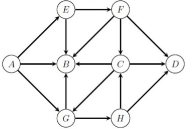{width="40%"}
    :::

    Which of the following is the longest path of the graph?

    1.  AEFBGHD

    2.  AEFCGHD

    3.  GAEFCHD

    4.  CBAEFCD

    \[Ans: (b)\]

24. The DFS (Depth First Search) tree of a graph starting with vertex
    $A$ is shown below. Choose the option which might be the original
    graph.

    ::: center
    :::

    1.  
    2.  
    3.  
    4.  

    \[Ans: (b)\]

25. What is the minimum number of colors required to color the graph
    given below?

    ::: center
    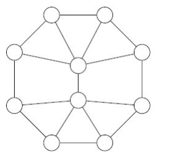{width="25%"}
    :::

    \[Ans: 3\]

26. Consider the following adjacency matrix of an undirected graph
    $$\begin{pmatrix}
    0 & 1 & 1 & 0 & 1 \\
    1 & 0 & 0 & 1 & 1 \\
    1 & 0 & 0 & 1 & 0 \\
    0 & 1 & 1 & 0 & 0 \\
    1 & 1 & 0 & 0 & 0
    \end{pmatrix}$$ which represents graph $G$ which has 5 vertices
    $A, B, C, D$ and $E$.

    Based on the above data, answer the given subquestions.

27. Which of the following options is/are true?

    1.  The number of vertices is 5.

    2.  The number of edges is 6.

    3.  Each vertex has degree 2.

    4.  There is an edge between every pair of vertices.

    \[Ans: (a), (b)\]

28. What is the size of the minimum vertex cover of graph G?

    \[Ans: 3\]

29. Consider the following graph:

    ::: center
    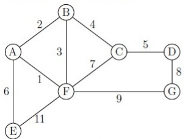{width="40%"}
    :::

    Calculate the cost of minimum spanning tree for the above graph.

    \[Ans: 26\]

# Quiz 1 Sep 23 {#quiz-1-sep-23 .unnumbered}

1.  In a survey among 140 people, it was found that 75% of these 140
    people like playing cricket and 50% of all the 140 people like
    playing football. Note that, some people may not like both games and
    that could be 0 also.

    1.  What is the minimum number of people who like both games?

        \[Ans: 35\]

    2.  If there are 10 people who don't like both games, then what is
        the number of people who like only cricket?

        \[Ans: 60\]

2.  Let $S$ be the set of all quadratic functions i.e.,
    $$S = \{ ax^2 + bx + c \mid a \neq 0,\, a, b, c, x \in \mathbb{R} \}.$$

    Define two relations $R_1$ and $R_2$ on the set $S$ i.e.,
    $R_1, R_2 : S \to S$ as follows:

    - $R_1$: Two elements of the set $S$ are said to be related if they
      have the same axis of symmetry.

    - $R_2$:
      $R_2 = \left\{ \left( (ax^2 + bx + c), (ax^2 + cx + b) \right) \mid a \neq 0,\, a, b, c, x \in \mathbb{R} \right\} \subset S \times S.$

    Use this information to answer the given subquestions.

    1.  Which of the following options is/are true?

        1.  $R_1$ is a reflexive relation.

        2.  $R_2$ is a symmetric relation.

        3.  $R_1$ is not a transitive relation.

        4.  $R_2$ is a transitive relation.

        \[ans: (i), (ii)\]

    2.  Which of the following options is true?

        1.  $R_1$ is a function.

        2.  $R_2$ is a function.

        3.  $R_2$ is not a one-one function.

        4.  $R_2$ is not an onto function.

        \[ans: (ii)\]

3.  Let $A = \{1, 2, 3, 4, 5\}$ and $B = \{2, 4, 6, 8\}$. Which of the
    following options is/are true?

    1.  $A \cap B = \{2, 4\}$

    2.  $A \cup B = \{1, 2, 3, 4, 5, 6, 8\}$

    3.  $A - B = \{1, 3, 5\}$

    4.  $B - A = \{6, 8\}$

    \[ans: (b), (d)\]

    1.  Consider the following three straight lines:\
        $\ell_1: 2x + 3y = 2$\
        $\ell_2: x + 3y = 5$\
        $\ell_3: 3x + 9y = 7$\
        Which of the following options is true?

        1.  $\ell_1$ and $\ell_2$ are parallel.

        2.  $\ell_2$ and $\ell_3$ are parallel.

        3.  $\ell_1$ and $\ell_3$ are perpendicular.

        4.  $\ell_1$ is equidistant from the line $\ell_2$ and $\ell_3$.

        \[ans: (b)\]

    Let $P$ be the intersection point of the lines $2x + y = 1$ and
    $x - y = 2$. Let $\ell$ be a straight line that passes through the
    point $P$ and the $y$-intercept of the polynomial
    $p(x) = x^3 + 3x + 1$. Consider the following data set in Table 1:

    $$\begin{array}{|c|c|c|c|c|}
    \hline
    x & 1 & 2 & -1 & 0 \\
    \hline
    y & -2 & -1 & 2 & 3 \\
    \hline
    \end{array}$$

4.  Which of the following options is true?

    1.  Slope of the line $\ell$ is $-2$.

    2.  Equation of the line $\ell$ is $-2x + y = 1$.

    3.  Equation of the line $\ell$ is $2x - y = 1$.

    4.  The distance of the line $x - y = 2$ from the point $(0, 1)$ is
        $1$ unit.

    \[ans: (a)\]

5.  Find the SSE, calculated for the line $\ell$.\
    \[ans: 10\]

6.  Consider a function $f(x) = |x| + x^2 + 2$. Which of the following
    options is true?

    1.  Domain of $f$ is $\mathbb{R} \setminus \{0\}$.

    2.  The minimum value of $f$ is 2.

    3.  $f$ is one-one function.

    4.  Range of $f$ is the interval $(0, \infty)$.

    \[Ans: (b)\]

7.  Consider a quadratic function $q(x) = ax^2 + 20x + 15$, where
    $a \in \mathbb{R} \setminus \{0\}$. If slope of $q(x)$ at $x = 2$ is
    equal to the slope of the line $y = 40x + 5$, then which of the
    following options is true?

    1.  $a = 5$

    2.  $a = 8$

    3.  $q(x)$ has a unique root.

    4.  $q(x)$ has the minimum value at $x = 2$.

    \[ans: (a)\]

8.  A retail shopkeeper is interested in purchasing clothes from a
    wholesale supplier. The price per clothing item is \$1800 if the
    purchase quantity is 150 items or less. However, if the shopkeeper
    buys more than 150 items, the cost per clothing item decreases by
    \$10 for each item exceeding the initial 150. For instance, if the
    shopkeeper acquires 160 items, the cost per clothing item would be
    $\$1800 - (10 \times (160 - 150)) = \$1700$. Let $x$ represent the
    number of items he buys. Determine the value of $x$ such that the
    amount paid by the retail shopkeeper to the wholesale supplier is
    maximum.

    \[ans: 165\]

9.  Consider a polynomial $p(x)$ whose graph is given below:

    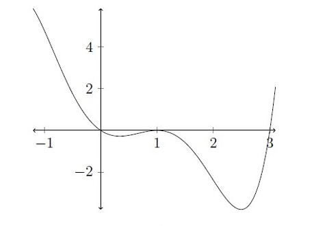{width="50%"}

    Which of the following options is/are true?

    1.  The minimum possible degree of $p(x)$ is 4.

    2.  There is a turning point at $x = 0$.

    3.  The number of turning points is 4.

    4.  The possible multiplicity of the root 3 is 1.

    \[ans: (a), (d)\]

10. Which of the following options is/are true?

    1.  If $S$ is the set $\{1,2,3,4\}$, then cardinality of the set
        $S \times S$ is 4.

    2.  Vertex of the parabola $y-1 = (x-2)^2$ is $(2, 1)$.

    3.  If $S$ is the set $\{1,2,3,4\}$, then any subset of the set
        $S \times S$ is a relation on set $S$.

    4.  A line that is parallel to $Y$-axis has slope $0$.

    \[ans: (b), (c)\]

11. Consider four polynomials $p(x), q(x), r(x)$ and $s(x)$ as follows:

    - $p(x) = x^2 - 5x - 6$

    - $q(x) = x + 1$

    - $r(x) = 2x^3 - 4x^2 - 6x$

    - $s(x) = p(x)q(x)r(x)$

    Which of the following options is/are true?

    1.  The degree of $p(x) + q(x)$ is 3.

    2.  The degree of $p(x)r(x)$ is 5.

    3.  When $p(x)$ divides $r(x)$ then obtained remainder is a linear
        function.

    4.  When $p(x)$ divides $r(x)$ then obtained remainder is a
        quadratic function.

    \[ans: (b), (c)\]

# Quiz 2 Sep 23 {#quiz-2-sep-23 .unnumbered}

1.  Consider the functions $f(x) = \sqrt{x+2}$ and
    $g(x) = \log(1 + x^2)$. Which of the following options is/are true?

    1.  $(f \circ g)(x) = \log(2x + 1).$

    2.  The domain of the function $(g \circ f)(x)$ is $[-2, -1]$.

    3.  $(g \circ f)(x) = \log(x + 3).$

    4.  The domain of the function $(g \circ f)(x)$ is $(-2, \infty)$.

    \[ans: (c), (d)\]

2.  Consider two functions $f(x) = \log_2(\log_2(\log_3 x))$ and
    $g(x) = -x^2 + 4x + 77$. Let $h(x)$ be a function defined as
    $h(x) := (f \circ g)(x)$ in its domain. Based on the above data,
    answer the given subquestions.

    1.  Find the maximum value of $g(x)$.\
        \[ans: 81\]

    2.  Find the maximum value of $h(x)$.\
        \[ans: 1\]

    <!-- -->

    1.  Find the number of solutions of the equation
        $e^{3x} - 4e^{2x} + 3e^{x} = 0$.\
        \[ans: 2\]

    2.  Find the value of $x$ that satisfies the equation
        $9^x - 2 \times 3^{x+1} - 27 = 0$.\
        \[ans: 2\]

3.  Let $f(2) = 10$ and $f'(2) = 4$. Then, calculate the value of
    $$\lim_{x \to 2} \frac{x f(2) - 2 f(x)}{x-2}$$

    \[ans: 2\]

4.  Calculate,
    $$\lim_{x \to 9} \frac{2\left(\sqrt{f(x)} - 3\right)}{\sqrt{x} - 3},$$
    given that $f(9) = 9$ and $f'(9) = 4$.

    \[ans: 8\]

5.  Choose the correct option for $f(x) = \dfrac{1}{x-1}$.

    1.  The function $(f \circ f)(x)$ in its domain is discontinuous
        only at the point/points $x=1$.

    2.  The function $(f \circ f)(x)$ in its domain is discontinuous
        only at the point/points $x=1$ and $x=2$.

    3.  The function $(f \circ f)(x)$ in its domain is discontinuous
        only at point/points $x=2$.

    4.  The function $(f \circ f)(x)$ in its domain is discontinuous
        only at point/points $x=1,\, x=2$ and $x=3$.

    \[ans: (b)\]

6.  Choose the set of **INCORRECT** options.

    1.  If a function is continuous at a particular point, then the
        function is differentiable at that point.

    2.  If a function is differentiable at a particular point, then the
        function must be continuous at that point.

    3.  If $f(x)$ and $g(x)$ are bijective functions, then
        $g \circ f(x)$ is also a bijective function.

    4.  If $f(x)$ and $g(x)$ are one-one functions, then $g \circ f(x)$
        is also one-one function.

    \[ans: (a)\]

7.  Given a function $$f(x) = 
    \begin{cases}
    \dfrac{|x|}{x} & \text{if } x \neq 0 \\
    1 & \text{if } x = 0
    \end{cases}$$ Which of the following options is/are true?

    1.  $\displaystyle \lim_{x \to 0^+} f(x) = f(0).$

    2.  $\displaystyle \lim_{x \to 0^-} f(x)$ does not exist.

    3.  $f$ is not continuous at $x = 0.$

    4.  $f$ is differentiable at $x = 0.$

    \[ans: (a), (c)\]

8.  Consider the graphs given below:

    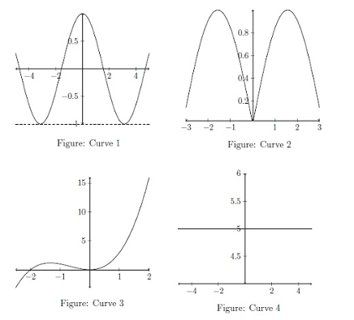{width="50%"}

    Choose the set of correct options:

    1.  There are at least two points on Curve 1, where the derivatives
        of the function corresponding to Curve 1 are equal.

    2.  At the origin the derivative of the function corresponding to
        Curve 2 does not exist.

    3.  The derivative of the function corresponding to Curve 3, at the
        origin and at the point $(-2, 0)$ are the same.

    4.  The derivative of the function corresponding to Curve 4 does not
        exist at any point.

    \[ans: (a), (b)\]

9.  Consider a function $f$ defined as, $$f(x) =
    \begin{cases}
    3mx + n & x < 1, \\
    11 & x = 1, \\
    5mx - 2n & x > 1.
    \end{cases}$$ If $f$ is continuous at $x = 1$, then the value of
    $m + n$ is\
    \[ans: 5\]

10. Let $f$ be a differentiable function such that $f(4) = 6$ and
    $f'(4) = -2$. What is the approximated value of $f(4.2)$ using the
    linear approximation of $f$ at $x = 4$?

    1.  5.3

    2.  5.4

    3.  5.5

    4.  5.6

    \[ans: (d)\]

# End Term Sep 23 {#end-term-sep-23 .unnumbered}

1.  Consider relations $R_1$ and $R_2$ on $\mathbb{N}$,
    $R_1 \subseteq \mathbb{N} \times \mathbb{N}$ and
    $R_2 \subseteq \mathbb{N} \times \mathbb{N}$, defined as
    $$R_1 = \{(a, b) \mid b \geq a + 1, \text{ and } a, b \in \mathbb{N}\}$$
    $$R_2 = \{(a, b) \mid b = a, \text{ and } a, b \in \mathbb{N}\}$$
    Which of the following option(s) is(are) true?

    1.  $R_1$ is reflexive but not symmetric.

    2.  $R_2$ is both reflexive and symmetric.

    3.  $R_1$ is transitive.

    4.  $R_2$ is both reflexive and transitive.

    \[ans: (b), (c), (d)\]

2.  Let $PQRS$ be a parallelogram with vertices $P(-1,2)$, $Q(3,-4)$,
    and $S(8,9)$. Let $(x, y)$ denote the coordinates of the fourth
    vertex $R$. Find the area of the $\triangle QRS$.

    \[ans: 41\]

3.  Which of the following is true about the polynomial
    $f(x) = 2x^3 - 3x^2 - 12x + 4$?

    1.  $f(x)$ is an increasing function in the interval $[-2, -1]$.

    2.  $2$ is a root of $f(x)$.

    3.  $f(x) \to \infty$ as $x \to \infty$.

    4.  The quotient obtained while dividing $f(x)$ by $(x+2)$ is a
        quadratic function.

    5.  $f(x)$ has $3$ turning points.

    \[ans: (a), (c), (d)\]

4.  Which of the following statements is/are true about the function
    $f(x) = -\left(e^{\log x}\right)^2$?

    1.  $f$ is not one-one.

    2.  $f$ does not have an inverse.

    3.  $f$ is a decreasing function.

    4.  The domain of $f$ is $(0, \infty)$.

    \[ans: (c), (d)\]

5.  Consider the function $$f(x) = 
    \begin{cases}
    k, & x \leq 0, \\
    \dfrac{1 - \cos 4x}{x^2}, & x > 0.
    \end{cases}$$ Consider the function above and answer the given
    sub-questions.

    Find the value of $\displaystyle \lim_{x \to 0^+} f(x)$.

    \[ans: 8\]

6.  Is this statement True or False: If $f$ is continuous at $x = 0$,
    then it is differentiable at $x = 0$ also.

    1.  True

    2.  False

    \[ans: (a)\]

7.  Let $a_n = f(n),\ n > 0$. Find
    $\displaystyle \lim_{n \to \infty} a_n$.\
    \[ans: 0\]

8.  An LED manufacturer determines that in order to sell $x$ number of
    LEDs, the price per LED (in thousands) must be $f(x) = 1000 - x$, if
    $x \leq 800$, and the manufacturer also determines that the total
    cost (in thousands) of producing $x$ number of LEDs is $$g(x) =
    \begin{cases}
    30000 + 300x & \text{if } x \leq 400, \\
    100x + 110000 & \text{if } 400 < x \leq 800.
    \end{cases}$$ Suppose the company can produce a maximum of 400 LEDs
    due to a production issue. The number of LEDs the company should
    produce and sell in order to maximize profit is

    \[ans: 350\]

9.  Consider a function $f(x) = 3x + 2$ in the interval $[0, 4]$. Find
    the area under the curve $f(x)$ in the interval $[0, 4]$.

    \[ans: 32\]

10. Is this statement True or False: If the interval $[0, 4]$ is divided
    into 4 equal parts, then the left Riemann sum is $26$.

    1.  True

    2.  False

    \[ans: (a)\]

11. Consider the function $f(x) = \sin x$. Let $\ell$ be the tangent
    line of the function at $x = \frac{1}{2}$. Use this information to
    answer the given sub-questions.

    Is this statement True or False: The tangent line $\ell$ has the
    equation
    $$y = \sin\left(\frac{1}{2}\right) - \cos\left(\frac{1}{2}\right)\left(x - \frac{1}{2}\right).$$

    1.  True

    2.  False

    \[ans: (b)\]

12. Is this statement True or False:
    $$\int_0^{\frac{\pi}{2}} f(x)\,dx = 1$$

    1.  True

    2.  False

    \[ans: (a)\]

13. Is this statement True or False: $f(x)$ has infinitely many critical
    points.

    1.  True

    2.  False

    \[ans: (a)\]

14. Consider the given graph:

    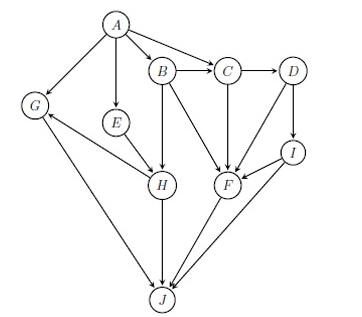{width="50%"}

    Which of the following orderings is the longest path of the graph?

    1.  AEHGIFJ

    2.  ABCDFIJ

    3.  ABCDIHJ

    4.  ABECDJ

    \[ans: (b)\]

15. Use the below graph to answer the given sub-questions.

    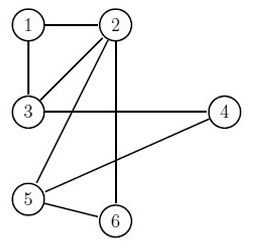{width="50%"}

    Which of the following options is/are true?

    1.  The Degree of each vertex is 3.

    2.  The minimum vertex cover is 4.

    3.  The given graph is planar.

    4.  The minimum number of colors to color the graph is 3.

    \[ans: (c), (d)\]

16. Which of the following is/are the BFS tree(s) starting from vertex
    $1$ of the given graph?

    1.  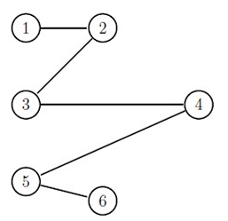{width="50%"}

    2.  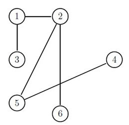{width="50%"}

    3.  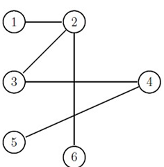{width="50%"}

    4.  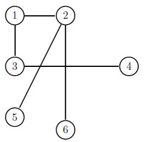{width="50%"}

    \[ans: (d)\]

17. Which of the following is (are) correct?

    1.  Floyd--Warshall algorithm does not work for graphs with negative
        weight cycles.

    2.  Floyd--Warshall algorithm is used for all pair shortest paths.

    3.  The Shortest path problem is applicable to a graph with a
        negative weight cycle.

    4.  Bellman--Ford algorithm is used for single source shortest path.

    5.  Dijkstra's algorithm is used for all pair shortest paths.

    \[ans: (a), (b), (d)\]

    Consider a weighted graph $G$ with $7$ vertices
    $\{ \text{rows and columns are in the order } V_1, V_2, V_3, V_4, V_5, V_6, V_7 \}$,
    which is represented by the following adjacency matrix. Use the
    following information for given sub-questions:

    $$\begin{bmatrix}
    0 & 12 & 0 & 0 & 18 & 0 & 14 \\
    12 & 0 & 0 & 16 & 0 & 0 & 0 \\
    0 & 0 & 0 & 16 & 0 & 4 & 0 \\
    0 & 16 & 16 & 0 & 4 & 0 & 6 \\
    18 & 0 & 0 & 4 & 0 & 0 & 10 \\
    0 & 0 & 4 & 0 & 0 & 0 & 10 \\
    14 & 0 & 0 & 6 & 10 & 10 & 0 \\
    \end{bmatrix}$$

18. Suppose we perform Kruskal's algorithm on the graph $G$ to find a
    minimum cost spanning tree (MCST). Which of the following edges are
    **not** added to the minimum cost spanning tree?

    1.  $(V_1, V_5)$

    2.  $(V_2, V_4)$

    3.  $(V_7, V_6)$

    4.  $(V_1, V_7)$

    \[ans: (a),(c)\]

19. Find the value of MCST.\
    \[ans: 54\]

# Quiz 1 May 23 {#quiz-1-may-23 .unnumbered}

1.  Let
    $S = \{\text{Jan}, \text{Feb}, \text{March}, \text{April}, \text{May}\}$
    be a set of months of a particular year. Consider the following
    relations on the set $S$.

    $$R_1 = \{\, (\text{Feb}, \text{Feb}),\ (\text{March}, \text{April}),\ (\text{April}, \text{March}),\ (\text{March}, \text{March})\,\}$$
    $$R_2 = \{\, (\text{Jan}, \text{Jan}),\ (\text{Feb}, \text{Feb}),\ (\text{March}, \text{March}),\ (\text{April}, \text{April}),\ (\text{May}, \text{May})\,\}$$

    From the below list of given terms, find out the best possible
    options for each of the given subquestions:

    1.  Reflexive relation

    2.  Symmetric relation

    3.  Transitive relation

    4.  Not a equivalence relation

    5.  Not a function

    6.  Injective (One-one) function

    7.  Surjective (Onto) Function

    <!-- -->

    1.  $R_1$ is . (Enter all correct options. Enter only the serial
        numbers of those options in increasing order without adding any
        comma or space in between them i.e., if your answer is 6 and 7,
        then you should enter 67)

        \[ans: 245\]

    2.  $R_2$ is . (Enter all correct options. Enter only the serial
        numbers of those options in increasing order without adding any
        comma or space in between them i.e., if your answer is 3 and 4,
        then you should enter 34)

        \[ans: 12367\]

    3.  Find the cardinality of the set $(S \times S) \setminus R_2$.\
        \[ans: 20\]

2.  A company opened recruitment for the post of data analyst. 500
    candidates have applied for the post. 285 candidates are proficient
    in Python programming, 195 candidates are proficient in C
    programming, 115 candidates are proficient in Java programming, 45
    candidates are proficient in Python and Java, 70 candidates are
    proficient in C and Python, 50 candidates are proficient in C and
    Java and 50 candidates don't know any of the programming languages.
    Find the number of candidates who are proficient in exactly one of
    the three programming languages.

    \[ans: 325\]

3.  Which of the following options is/are true?

    1.  If $m$ and $n$ are $x$-intercept and $y$-intercept of the line
        $2x + 3y = 6$, respectively, then $m + n = 6$

    2.  The $y$-intercept of a line is the perpendicular distance to the
        line from the origin.

    3.  The lines $2x + 3y = 6$ and $3x - 2y = 6$ are perpendicular to
        each other.

    4.  The distance between two parallel lines $2x + 3y = 6$ and
        $4x + 6y = 12$ is $0$.

    \[ans: (c), (d)\]

4.  Consider the points $A(0,3)$, $B(x,y)$, $C(4,3)$, $D(1,0)$ and
    $E(3,1)$ in the coordinate system. Suppose the point $B$ divides
    internally the line segment $AC$ in the ratio $k:1$. If the area of
    triangle $DEB$ is $2$, then find the positive value of $k$.\
    \[ans: 3\]

5.  Suppose the line $y = 2x + k$ is the best fit line using SSE for the
    data set given in Table 1 for some $k \in \mathbb{R}$.
    $$\begin{array}{c|cccc}
    x & 1 & 2 & -1 & 0 \\
    \hline
    y & 2 & 3 & -3 & -1 \\
    \end{array}$$ Find the value of $16k$.\
    \[ans: -12\]

6.  Consider a quadratic function $q(x) = ax^2 + bx + c$, where
    $a, b, c \in \mathbb{R}$ and $a \neq 0$ with the following
    information:

    - The Maximum value attained by $q(x)$ is at $x = -1$.

    - Discriminant value of $q(x)$ is $8$.

    - Slope of the function at $x = 1$ is $8$.

    Find the value $q(2)$.\
    \[ans: 17\]

7.  Consider a polynomial $p(x) = 0.3x^3(x^2 - 1)(x - 2)^2(x - 3)$.\
    Which of the figure represents the polynomial $p(x)$?

    1.  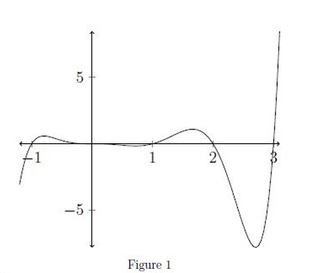{width="50%"}

    2.  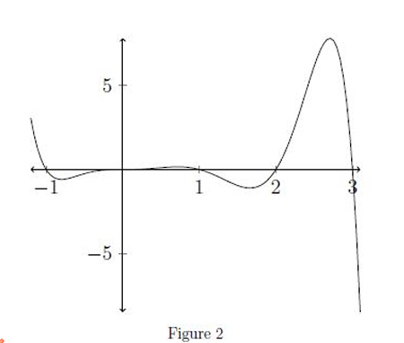{width="50%"}

    3.  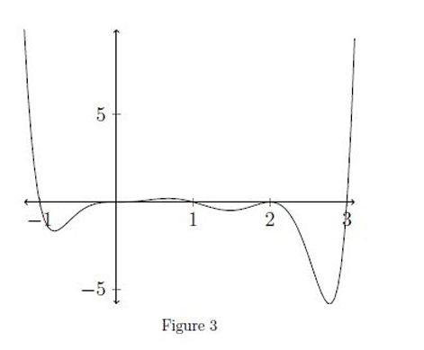{width="50%"}

    4.  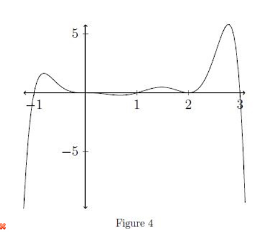{width="50%"}

    \[ans: (c)\]

8.  Consider two polynomials $p(x) = x^4 + 3x^3 - 9x + 8$ and
    $q(x) = (x^2 + x)(x + 3)$. Let $r(x)$ be the remainder obtained when
    $p(x)$ is divided by $q(x)$. Let $l(x)$ be the line that passes
    through the $y$-intercept and the minimum point in the graph of
    $r(x)$. For reference, see Figure: M1Q1-1.

    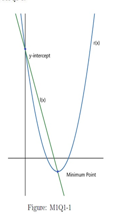{width="25%"}

    Which of the following options is/are true?

    1.  $r(x) = x^2 - 6x + 9$

    2.  $l(x) \equiv y = -3x + 8$

    3.  $l(x) \equiv y = -2x + 8$

    4.  The number of turning points in $q(x)$ is $2$

    \[ans: (b), (d)\]

9.  A company's profit function, given by $P(x) = -2x^2 + 8x - 6$,
    represents the relationship between the quantity ($x$) of the raw
    material used in the manufacturing process and the resulting profit.
    Use this information to answer the given subquestions.

    1.  Find the quantity of the raw material such that the company has
        the maximum profit.\
        \[ans: 2\]

    2.  Find the quantity of the raw material ($x > 1$) such that the
        company has no profit.\
        \[ans: 3\]

10. Consider a polynomial
    $$p(x) = (x^2 - 1)(x^3 - 4x^2 + 4x)(x^3 - 10x^2 + 33x - 36)$$ such
    that

    - $t(x) = (x^3 - 6x^2 + 9x)$ divides $p(x)$,

    - $s(x) = (x^2 - 5x + 4)$ divides $p(x)$,

    - $q(x)$ is the quotient when $p(x)$ is divided by the polynomial
      $z(x) = (x+1)t(x)s(x)$.

    Use this information to answer the given subquestions:

    1.  If $m$ is the number of distinct roots and $n$ is the number of
        turning points of the polynomial $p(x)$, then find the value of
        $m + n$.\
        \[ans: 13\]

    2.  Which of the following options is/are true?

        1.  The Minimum value of the quotient $q(x)$ is $0$.

        2.  $p(x)$ is an odd degree polynomial.

        3.  End behavior $p(x) \to +\infty$ as $x \to +\infty$.

        4.  End behavior $p(x) \to +\infty$ as $x \to -\infty$.

        \[ans: (i), (iii), (iv)\]

# Quiz 2 May 23 {#quiz-2-may-23 .unnumbered}

1.  Define a function $$f(x) = 
    \begin{cases}
    x^2 + 1 & \text{if } x < 1 \\
    x^3 & \text{if } x \geq 1
    \end{cases}$$ Which of the following options is/are true?

    1.  $f(x)$ is invertible in its domain.

    2.  $f(x)$ is invertible when the domain is restricted to
        $[1, \infty)$.

    3.  $f(x)$ is invertible when the domain is restricted to $[-1, 1]$.

    4.  The inverse of $f(x)$ when the domain is restricted to
        $[1, \infty)$ is $f^{-1}(x) = \sqrt[3]{x}$.

    5.  The inverse of $f(x)$ when the domain is restricted to
        $(-\infty, 0)$ is $f^{-1}(x) = \sqrt{x-1}$.

    \[ans: (b), (d)\]

2.  Consider the functions $f(x) = \log x^2$ and $g(x) = 2x + 1$. Which
    of following options is/are true?

    1.  The domain of the function $(f \circ g)(x)$ is
        $\mathbb{R} \setminus \{-\frac{1}{2}\}$.

    2.  $(f \circ g)(x) = \log(2x + 1)$.

    3.  The domain of the function $(g \circ f)(x)$ is
        $\mathbb{R} \setminus \{-\frac{1}{2}\}$.

    4.  $(g \circ f)(x) = 2\log x^2 + 1$.

    5.  The domain of the function $(g \circ f)(x)$ is
        $\mathbb{R} \setminus \{0\}$.

    \[ans: (a), (d), (e)\]

3.  If $n$ is the number of solutions of the equation
    $2^{2x+3} - 6 \cdot 2^x + 1 = 0$, then find the value of $4n$.\
    \[ans: 8\]

4.  Consider the equation
    $\log_3\left(\log_4(x^2 + 1)^2 + \log_8 8x^3\right) = 0$. Then find
    the value of $x(x^2 + 1) + 7$.\
    \[ans: 8\]

5.  Let $\{a_n\}$ be a sequence defined as $a_n = \dfrac{2n+1}{4n+3}$.
    Consider the sequence $\{b_n\}$ defined by
    $b_n = 4(3a_n^2 + 2a_n + 5)$. Use this information to answer the
    subquestions.

    1.  What is the limit of the sequence $\{a_n\}$?\
        \[ans: 0.5\]

    2.  What is the limit of the sequence $\{b_n\}$?\
        \[ans: 27\]

6.  Define a function $$f(x) = 
    \begin{cases}
    \dfrac{|x-3|}{x-3} & \text{if } x \neq 3 \\
    1 & \text{if } x = 3
    \end{cases}$$ Which of the following options is/are true?

    1.  $\displaystyle \lim_{x \to 3^+} f(x) = f(3).$

    2.  $\displaystyle \lim_{x \to 3} f(x)$ does not exist.

    3.  $f$ is not continuous at $x = 3.$

    4.  $f$ is differentiable at $x = 3.$

    5.  $f'(7) = 1.$

    \[ans: (a), (c)\]

7.  Consider the following functions $f_1 : D_1 \to \mathbb{R}$,
    $f_2 : D_2 \to \mathbb{R}$, $f_3 : D_3 \to \mathbb{R}$ and
    $g : D \to \mathbb{R}$, defined as:

    - $f_1(x) = \sin 2x$

    - $f_2(x) = \ln(x^2 - 6x + 8)$

    - $f_3(x) = e^{3x} + 5$

    - $g(x) = f_1(x) + f_2(x) + f_3(x)$

    Let $D_1, D_2, D_3$ and $D$ be the (largest) domains of the
    functions $f_1(x), f_2(x), f_3(x)$ and $g(x)$, respectively. Use
    this information to answer the subquestions.

    1.  Which of the following options is/are true?

        1.  $D = D_1 \cap D_2 \cap D_3$

        2.  $D_1 = D_3$ and $D = D_2$

        3.  $D = (-\infty, 2) \cup (4, \infty)$

        4.  $D = (-\infty, 2] \cup [4, \infty)$

        \[ans: (a), (b), (c)\]

    2.  Which of the following options is/are true?

        1.  Function $g(x)$ is not differentiable in its domain.

        2.  Function $g(x)$ is continuous in its domain.

        3.  If function $g(x)$ is differentiable in its domain, then
            derivative of the function is
            $g'(x) = 2\cos 2x + \dfrac{2x-6}{x^2-6x+8} + 3e^{3x}$.

        4.  If function $g(x)$ is differentiable in its domain, then
            derivative of the function is
            $g'(x) = 2\cos 2x + \dfrac{1}{x^2-6x+8} + 3e^{3x}$.

        \[ans: (b), (c)\]

8.  Which of the following options is/are true?

    1.  If a function is continuous at a particular point, then the
        function is differentiable at that point.

    2.  If a function is differentiable at a particular point, then the
        function must be continuous at that point.

    3.  If a function is continuous at a particular point, then the
        limit of the function exists at that point.

    4.  If the limit of a function exists at a particular point, then
        the function is continuous at that point.

    \[ans: (b), (c)\]

9.  Consider three differentiable functions $f(x)$, $g(x)$ and $h(x)$
    such that
    $$f(x) = g(2x^2 + x) h(3x^3 + x), \quad g'(0) = g(0) = 3, \quad h'(0) = h(0) = 1.$$
    Use this information to answer the subquestions.

    1.  Which of the following options is/are true?

        1.  $f'(x) = (4x + 1)g'(2x^2 + x)h(3x^3 + x) + (9x^2 + 1)g(2x^2 + x)h'(3x^3 + x)$

        2.  $f'(0) = 2g(0)h(0)$

        3.  $f(0) = g(0)h(0)$

        \[ans: (a), (b), (c)\]

    2.  Find the value of
        $$\frac{f'(0)}{f(0)} + \lim_{x \to 0} f(x) + \lim_{x \to 0} g(x) + \lim_{x \to 0} h(x).$$
        \[ans: 9\]

10. Consider the function $f(x)$ given below: $$f(x) = 
    \begin{cases}
    2x^2 \sin\left(\frac{1}{x}\right) + b & \text{if } x \neq 0, \\
    5 & \text{if } x = 0
    \end{cases}$$ Assume that $f$ is continuous at $x = 0$. Use this
    information to answer the subquestions.

    1.  Find the value of $b$.\
        \[ans: 5\]

    2.  Which of the following options is/are true for the function
        $f(x)$ at $x = 1$?

        1.  The best linear approximation is
            $L_f(x) = (4\sin 1 - 2\cos 1)x - 2\sin 1 + 2\cos 1 + 5.$

        2.  The best linear approximation is
            $L_f(x) = (4\sin 1 + 2\cos 1)x - 2\sin 1 + 2\cos 1 + 5.$

        3.  The tangent line is
            $y = (4\sin 1 + 2\cos 1)x - 2\sin 1 + 2\cos 1 + 5.$

        4.  The tangent line is
            $y = (4\sin 1 - 2\cos 1)x - 2\sin 1 + 2\cos 1 + 5.$

        \[ans: (a), (d)\]

# End Term May 23 {#end-term-may-23 .unnumbered}

1.  Each student in a class of 40 plays at least one indoor game: chess,
    carrom, and scrabble. 18 play chess, 20 play scrabble, and 27 play
    carrom. 7 play chess and scrabble, 12 play scrabble and carrom, and
    4 play chess, carrom, and scrabble.

    1.  Find the number of students who play both chess and carrom.\
        \[ans: 10\]

    2.  Find the number of students who play chess, carrom but not
        scrabble.\
        \[ans: 6\]

2.  Consider the three polynomials: $$\begin{align*}
    p(x) &= 5x^5 + a_1 x^4 + b_1 x^2 + c_1, \\
    q(x) &= -x^4 + a_2 x^2 + b_2 x + c_2, \\
    s(x) &= -x^7 + a_3 x^5 + b_3 x^3 + c_3 x^2 + d_3 x + e_3.
    \end{align*}$$ Use this information to answer the given
    subquestions.

    1.  Which of the following options is/are true?

        1.  If $r_1(x)$ is the obtained remainder when $q(x)$ divides
            $p(x)$, then the maximum possible degree of $r_1(x)$ is $2$.

        2.  If $r_2(x)$ is the obtained remainder when $p(x)$ divides
            $s(x)$, then the maximum possible degree of $r_2(x)$ is $2$.

        3.  If $t_1(x)$ is the obtained quotient when $q(x)$ divides
            $p(x)$, then the possible degree of $t_1(x)$ is $1$.

        4.  If $t_2(x)$ is the obtained quotient when $p(x)$ divides
            $s(x)$, then the possible degree of $t_2(x)$ is $2$.

        \[ans: (c), (d)\]

    2.  Which of the following options is/are true?

        1.  The maximum possible number of turning points in $s(x)$ is
            $6$.

        2.  The maximum possible number of turning points in $p(x)$ is
            $5$.

        3.  $q(x) \to \infty$ as $x \to \infty$.

        4.  $s(x) \to -\infty$ as $x \to \infty$.

        \[ans: (a), (d)\]

3.  Consider the following functions:

    - $f(x) = \log |x-1|$

    - $g(x) = \log x^3$

    Which of the following option is true?

    1.  $f(x)$ is invertible.

    2.  $g(x)$ is invertible.

    3.  Domain of $(f \circ g)(x)$ is the interval $(0, \infty)$.

    4.  Domain of $(g \circ f)(x)$ is the interval $(2, \infty)$.

    \[ans: (b)\]

4.  Consider the following piecewise function: $$f(x) = 
    \begin{cases}
    5^x, & x < 0 \\
    1, & x = 0 \\
    x^{1/5} + 2, & x > 0
    \end{cases}$$ Use this information to answer the given
    sub-questions.

    1.  The solid points denote the value of the function at the points,
        and the function does not take the values denoted by the hollow
        points. Which of the following figures may represent the graph
        of the function?

        1.  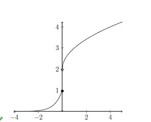{width="50%"}

        2.  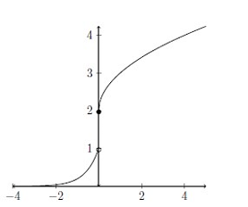{width="50%"}

        3.  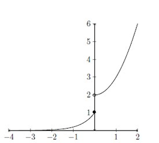{width="50%"}

        4.  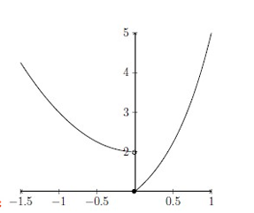{width="50%"}

        \[ans: (a)\]

    2.  Which of the following options is (are) true?

        1.  $f(x)$ is a bounded function.

        2.  $f(x)$ is differentiable at $x = 0$.

        3.  $f(x)$ is continuous at $x = 0$.

        4.  $\displaystyle \lim_{x \to -\infty} f(x) = 0$.

        5.  $\displaystyle \lim_{x \to 0^-} f(x) = 1$.

        \[ans: (d), (e)\]

5.  The melting point of ice and boiling point of water in Celsius scale
    is $0^\circ$ and $100^\circ$ Centigrade respectively, and in
    Fahrenheit scale is $32^\circ$ and $212^\circ$ Fahrenheit
    respectively. If the change in Fahrenheit scale varies linearly with
    respect to Celsius scale, then at what temperature (in $^\circ$
    Centigrade) do both the scales read the same?\
    \[ans: -40\]

6.  The point on the curve $x^2 = 2y$ which is nearest to the point
    $(0, 5)$ is

    1.  $(2\sqrt{2}, 0)$

    2.  $(0, 0)$

    3.  $(2, 2)$

    4.  $(2\sqrt{2}, 4)$

    \[ans: (d)\]

7.  An arrow is shot horizontally off from a tower that is $80$ m high
    and follows a parabolic path. If the height (in m) from the ground
    with respect to time (in sec) follows the formula
    $h(t) = 80 - 5t^2$, then answer the given subquestions:

    1.  How much time (in sec) will the arrow take to reach the ground?\
        \[ans: 4\]

    2.  Which of the following options is/are true?

        1.  The slope of the tangent line at $t = 2$ is $-20$.

        2.  The linear approximation ($L_h(t)$) of the function $h(t)$
            at $t = 2$ is $L_h(t) = 100 + 20t$.

        3.  The equation of the tangent line of the function $h(t)$ at
            $t = 3$ is $y = 125 - 30t$.

        4.  The linear approximation ($L_h(t)$) of the function $h(t)$
            at $t = 2$ is $L_h(t) = 125 - 30t$.

        \[ans: (a),(c)\]

8.  Define a function $f$ in the interval $[-2, 10]$ as follows:
    $$f(x) =
    \begin{cases}
    2x^2 & \text{if } -2 \leq x < 2 \\
    (x-2)^3 & \text{if } 2 \leq x < 4 \\
    -\dfrac{2}{3}(x-4) + 4 & \text{if } 4 \leq x \leq 10
    \end{cases}$$ Below represents the graph of the function $f$. The
    solid points denote the value of the function at the points, and the
    values denoted by the hollow points are not taken by the function.

    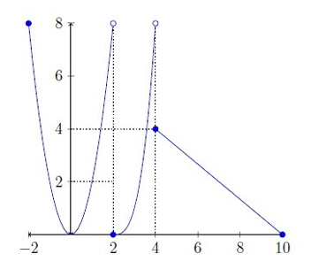{width="50%"}

    Use this information to answer the given sub-questions.

    1.  Consider the integration:
        $$\int_{-2}^{2} f(x)\, dx = \frac{32}{3}.$$

        1.  True

        2.  False

        \[ans: (a)\]

    2.  Consider the integration: $$\int_{2}^{4} f(x)\, dx = 5.$$

        1.  True

        2.  False

        \[ans: (b)\]

    3.  Consider the derivative:
        $$f'(x) = 3(x^2 - 4x + 4) \quad \text{in the interval } (2,4).$$

        1.  True

        2.  False

        \[ans: (a)\]

    4.  Consider the derivative:
        $$f'(x) = \frac{2}{3} \quad \text{in the interval } (4,10).$$

        1.  True

        2.  False

        \[ans: (b)\]

9.  Define a function $f$ in the interval $[-2, 10]$ as follows:
    $$f(x) =
    \begin{cases}
    2x^2 & \text{if } -2 \leq x < 2 \\
    (x-2)^3 & \text{if } 2 \leq x < 4 \\
    -\dfrac{2}{3}(x-4) + 4 & \text{if } 4 \leq x \leq 10
    \end{cases}$$ Below represents the graph of the function $f$. The
    solid points denote the value of the function at the points, and the
    values denoted by the hollow points are not taken by the function.

    {width="50%"}

    Use this information to answer the given sub-questions.

    1.  The number of critical points in $(-2, 10)$ is $7$.

        1.  True

        2.  False

        \[ans: (b)\]

    2.  In $[-2, 10]$, the global maximum is attained at $x = -2$.

        1.  True

        2.  False

        \[ans: (a)\]

    3.  In $[-2, 10]$, the global minimum is attained at $x = 4$.

        1.  True

        2.  False

        \[ans: (b)\]

    4.  There are two points where $f$ is not differentiable in
        $(-2, 10)$.

        1.  True

        2.  False

        \[ans: (a)\]

10. An undirected graph $G$ has $12$ edges. Find the number of vertices,
    if the degree of each vertex in $G$ is $2$.\
    \[ans: 12\]

11. Consider the adjacency matrix of an undirected graph $G$:
    $$\begin{bmatrix}
    0 & 1 & 0 & 1 & 0 \\
    1 & 0 & 1 & 0 & 1 \\
    0 & 1 & 0 & 1 & 1 \\
    1 & 0 & 1 & 0 & 1 \\
    0 & 1 & 1 & 1 & 0 \\
    \end{bmatrix}$$ Use this information to answer the given
    sub-questions.

    1.  Which of the following options is/are true?

        1.  The Number of edges is 8.

        2.  The Number of vertices is 5.

        3.  The Number of edges is 7.

        4.  Each vertex has degree 3.

        \[ans: (b), (c)\]

    2.  What is the size of the minimum vertex cover of graph $G$?\
        \[ans: 3\]

12. Consider the following graph $G$.

    {width="50%"}

    Which of the following is(are) **not** spanning tree(s) of $G$?

    1.  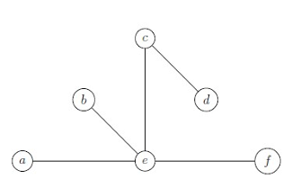{width="50%"}

    2.  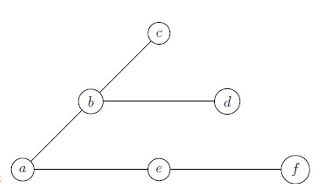{width="50%"}

    3.  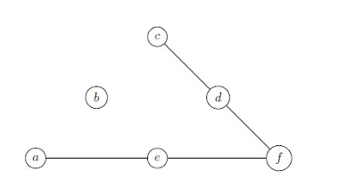{width="50%"}

    4.  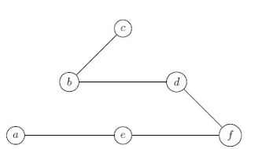{width="50%"}

    \[ans: (a), (C)\]

13. An undirected weighted graph $G$ is given in the below figure.

    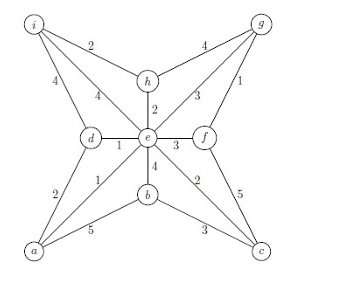{width="50%"}

    Which of the following option is true?

    1.  The cost of the minimum spanning tree is $15$.

    2.  The cost of the minimum spanning tree is $14$.

    3.  The cost of the minimum spanning tree is $13$.

    4.  The cost of the minimum spanning tree is $16$.

    \[ans: (a)\]

# Quiz 1 Jan 23 {#quiz-1-jan-23 .unnumbered}

1.  The Cartesian product $A \times A$ has $9$ elements. Two of the
    elements of the Cartesian product are $(2, 0)$ and $(0, 8)$. Find
    the sum of all the elements in set $A$.\
    \[ans: 10\]

2.  In a survey among $250$ students in Nilgiri house of IITM BSc
    degree, the following data were found:

    - $100$ students have a Hotstar subscription

    - $110$ students have Netflix subscription

    - $120$ students have Amazon Prime membership

    - $30$ students have both Hotstar and Netflix subscriptions

    - $30$ students have both Hotstar and Amazon Prime

    - $40$ students subscribe to both Netflix and Amazon Prime

    Assuming that all students have at least one OTT subscription,
    determine how many students have memberships to all $3$ OTT:
    Hotstar, Netflix and Amazon Prime?\
    \[ans: 20\]

3.  Suppose $A = \{a, b, c, d\}$ and $B = \{p, q, r, s\}$ are two sets.
    Consider the following relations from $A$ to $B$: $$\begin{aligned}
    R_1 &= \{(a,p), (c,r), (d,q)\} \\
    R_2 &= \{(a,s), (b,s), (c,p), (d,r)\} \\
    R_3 &= \{(a,p), (b,r), (c,s), (d,q)\} \\
    R_4 &= \{(a,r), (b,p), (c,q), (d,s)\}
    \end{aligned}$$ Which of the following statements are correct?

    1.  $R_2, R_3,$ and $R_4$ are functions.

    2.  $R_2$ and $R_4$ are functions.

    3.  $R_2$ is an injective function.

    4.  $R_4$ is a bijective function.

    \[ans: (b), (d)\]

4.  You have been closely monitoring your bike's mileage recently. Here
    is a table showing two rows representing the amount paid for fuel
    (in \$) and the corresponding mileage (in Km). Consider $y$ as the
    amount paid and $x$ as the corresponding mileage in Km. You have
    noted down the distance traveled each time when the fuel meter falls
    back to a fixed reference mark and predicted that the equation of
    the best fit line is $y = 5x - 22$. What will be the value of SSE
    w.r.t the best fit line? $$\begin{array}{c|ccccc}
    \text{Amount paid (in \$)} & 80 & 50 & 60 & 100 & 48 \\
    \text{Distance (in Km)} & 20 & 15 & 16 & 25 & 14 \\
    \end{array}$$ \[ans: 26\]

5.  Assume that a ball was thrown from the point $(0,4)$ on the
    $XY$-plane as shown in the Figure 1. The ball reaches a maximum
    height of $6$ meters and it returns to a height of $4$ m after $2$
    seconds. Let $h(t) = at^2 + bt + c$ be the quadratic function that
    represents the height (in meters) of the ball after $t$ seconds,
    where $a, b, c \in \mathbb{Z} \setminus \{0\}$.\
    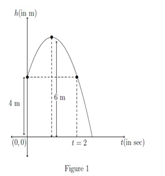{width="50%"}

    Find the value of $a + b + c$.\
    \[ans: 6\]

6.  Which of the following functions may represent the graph given in
    Figure 2?

    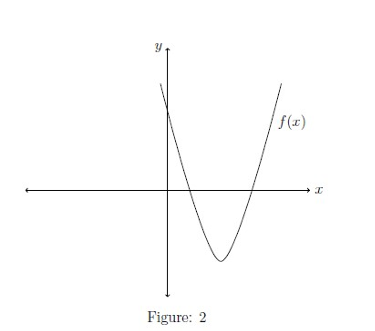{width="50%"}

    1.  $f(x) = x^2 - 8x + 12$

    2.  $f(x) = x^2 + 10x - 21$

    3.  $f(x) = 2x^2 + 8x + 4$

    4.  $f(x) = x^2 - 6x + 4$

    \[ans: (a),(d)\]

7.  Ankit is located at $(3, 3)$. He called Ajay to ask his location.
    Ajay describes the path he had taken from home (located at the
    origin) as: \"I walked three units towards East and then nine units
    towards North. And I repeated the same pattern thrice.\" Now Ankit
    wants a direct path to reach Ajay, then choose the correct options.
    (Note that North represents the direction along the positive
    $y$-axis.)

    1.  Ankit should follow $4x - y - 9 = 0$.

    2.  Ankit will have to walk a distance of $6\sqrt{17}$ units.

    3.  Ajay has walked a distance of $36$ units from his home.

    4.  Ajay has walked a distance of $9\sqrt{10}$ units from his home.

    \[ans: (a), (b), (c)\]

8.  Rubika launches her new company in the year 2010, which makes a
    yearly profit in lakhs as the polynomial function
    $p(x) = 0.1x^2(x-1)(x-2)(x-3)^2(x-4)(x-9)$ for the first 12 years
    since the launch, where $x$ is the number of years since 2010 (i.e.,
    $x = 0$ denotes the year 2010, $x = 1$ denotes the year 2011, and so
    on). Let the loss be represented as $-ve$ of profit. Which of the
    following options are correct?

    1.  Including the year in which the company was launched, it neither
        made a profit nor a loss six times in 12 years.

    2.  The company made profit in years $x \in \{7, 8, 10, 11\}$.

    3.  The company made loss ($-ve$ profit) in years
        $x \in \{5, 6, 7, 8\}$.

    4.  In the year 2022 (i.e., $x = 12$) the company made profit.

    \[ans: (a), (c), (d)\]

9.  Figure 2 shows the graph of a polynomial $p(x)$. Choose the set of
    correct option(s).

    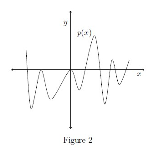{width="50%"}

    1.  The degree of $p(x)$ is at least $10$.

    2.  $p(x)$ represents an even degree polynomial.

    3.  Total number of turning points of $p(x)$ are $8$.

    4.  Multiplicities of zero and one of the negative roots could be
        the same.

    \[ans: (a),(b),(d)\]

10. Figure 3 shows the curves represented by polynomials $f(x)$, $g(x)$,
    and $h(x)$ of degrees $4$, $4$, and $2$ respectively, on the $XY$
    plane. Let $f(x) - g(x) = a x (x-2)(x-5)(x-10)$, $a \neq 0$. If $b$
    is a negative constant, then choose the most possible expression for
    $h(x)$ and any other correct statements among the given options.

    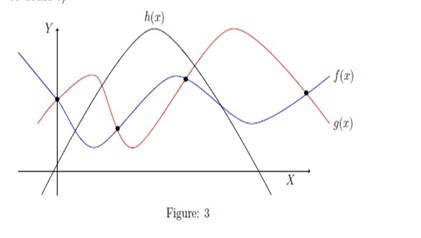{width="50%"}

    1.  $h(x) = b(x^2 + 8x - 7)$

    2.  $f(x) = g(x)$ at $x = 0, -2, -5, -10$

    3.  $h(x) = b(x^2 - 6x - 7)$

    4.  $f(x) = g(x)$ at $x = 0, 2, 5, 10$

    \[ans:(C), (d)\]

# Quiz 2 Jan 23 {#quiz-2-jan-23 .unnumbered}

1.  Consider two functions $f(x) = x^{4\log_2 x}$ and $g(x) = \sqrt{2x}$
    in their respective domains. Let $h(x) = (f \circ g)(x)$. Use this
    information to answer the given subquestions.

    1.  Which of the following options is/are true?

        1.  Domain of the function $f(x)$ is the interval
            $(0,1) \cup (1,\infty)$.

        2.  $h(x) = (\sqrt{2x})^{4\log_{\sqrt{2x}} \sqrt{2x}}$.

        3.  $h(x) = (\sqrt{2x})^{4\log_{\sqrt{x}} \sqrt{2x}}$.

        4.  Domain of the function $\dfrac{1}{\sqrt{g(x)}}$ is the
            interval $[0, \infty)$.

        \[ans: (a), (b)\]

    2.  For what value of $x$ does the function $h(x)$ have value $64$?\
        \[ans: 4\]

2.  Which of the following options is/are true?

    1.  $\log_3 2 < 1$

    2.  $\dfrac{1}{3} < \log_3 2 < \dfrac{1}{2}$

    3.  $\log_3 2$ is an irrational number.

    4.  $\log_a b < 1$, if $a > 1$, $b > 1$ and $b > a$.

    \[ans: (a), (c)\]

3.  Which of the following is the graph of the function
    $f(x) = e^{|x|}$?

    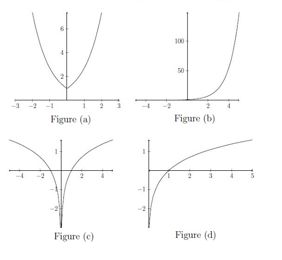{width="50%"}

    1.  Figure (a)

    2.  Figure (b)

    3.  Figure (c)

    4.  Figure (d)

    \[ans: (a)\]

4.  Find the number of solutions of the equation $2^{x^x} = 2x$.\
    \[ans: 2\]

5.  Consider the function $f(x) = e^{|x|}$. Use this information to
    answer the given subquestions.

    1.  Which of the following options is/are true?

        1.  $f(x)$ is an increasing function.

        2.  $f(x)$ is a one-one function.

        3.  $f(x)$ is not invertible.

        4.  $f(x)$ is an even function.

        \[ans: (3), (4)\]

    2.  Which of the following options is/are true?

        1.  $f(x)$ is differentiable at $x = 0$.

        2.  $\displaystyle \lim_{x \to 0} f(x)$ exists.

        3.  $f(x)$ is continuous in its domain.

        4.  $\displaystyle \lim_{x \to 0} f(x) = 0$.

        \[ans: (2), (3)\]

6.  Find the limit of the following sequence.
    $$a_n = \frac{2022 + 8 \times 2023^n}{2024 + 4 \times 2023^n}$$
    \[ans: 2\]

7.  Find the limit of the following sequence.
    $$a_n = \frac{8n^2 + 10n}{2n^2 + 6n - 7}$$ \[ans: 4\]

8.  Find the following limit.
    $$\lim_{x \to 0} \frac{\sqrt{4 + 8x} - 2}{x}$$ \[ans: 2\]

9.  Find the following limit.
    $$\lim_{x \to 0^+} \frac{\sin 2x}{\sqrt{2x}}$$ \[ans: 0\]

10. Consider the following graph of a function $f(x)$ in the interval
    $[-2, 6)$ in Figure 3, where bullet point represents the point
    included in the line segment and circle represents the point not
    included in the line segment. Use this information to answer the
    given subquestions.

    {width="50%"}

    1.  Find the value of $f(1)$.\
        \[ans: 0\]

    2.  If $f'(3) = 1$, then which of the following is the linear
        approximation ($L_f(x)$) of the function at $x = 3$?

        1.  $L_f(x) = x - 3$

        2.  $L_f(x) = x + 3$

        3.  $L_f(x) = -x - 3$

        4.  $L_f(x) = -x + 3$

        \[ans: (a)\]

    3.  Which of the following options is/are true?

        1.  Function $f(x)$ is one-one in the interval $[-2, 6)$.

        2.  Function $f(x)$ is increasing in the interval $[1.5, 2]$.

        3.  Function $f(x)$ is invertible in the interval $[2, 4]$.

        4.  Function $f(x)$ is constant in the interval $[-2, 1.5]$.

        \[ans: (c), (d)\]

11. Consider the following graph of a function $f(x)$ in the interval
    $[-2, 6)$ in Figure 3, where bullet point represents the point
    included in the line segment and circle represents the point not
    included in the line segment. Use this information to answer the
    given subquestions.

    {width="50%"}

    1.  Find the number of points where the function $f(x)$ is not
        differentiable.\
        \[ans: 3\]

    2.  Find the number of points where the function $f(x)$ is not
        continuous.\
        \[ans: 1\]

    3.  Find the left limit $\displaystyle \lim_{x \to 4^-} f(x)$.\
        \[ans: 1\]

    4.  Find the right limit $\displaystyle \lim_{x \to 4^+} 10 f(x)$.\
        \[ans: 8\]

# End Term Jan 23 {#end-term-jan-23 .unnumbered}

1.  If $A = \{3, 5, 7, 9, 10\}$, $B = \{7, 9, 10, 13\}$, and
    $C = \{10, 13, 15\}$ then find the cardinality of
    $(A \cap B) \cap (B \cup C)$.\
    \[ans: 3\]

2.  The equation of a line passing through the intersection of lines
    $x - y + 2 = 0$ and $3x + y - 10 = 0$, and perpendicular to the line
    $3x + 4y - 7 = 0$ is

    1.  $4x - 3y + 7 = 0$

    2.  $3x - y - 2 = 0$

    3.  $4x - 3y + 4 = 0$

    4.  $3x - y + 2 = 0$

    \[ans: (c)\]

3.  If $x + a$ is one of the factors of $p(x) = 2x^2 + 2ax + 5x + 10$,
    then find the value of $a$.

    \[ans: 2\]

4.  Consider a polynomial $p(x) = 4x^3 + 9x^2 + 3x + 2$. If
    $p(x) = (x+2)(a x^2 + b x + c)$, then find the value of
    $a + b + c$.\
    \[ans: 6\]

5.  Consider a quadratic function $f(x) := ax^2 + bx + c$ which is
    symmetric about the line $x = -3$. The maximum value of $f$ is $12$
    and it passes through the point $(0, 0)$. What is the value of
    $3a + b + c$?

    \[ans: -12\]

6.  Consider a function $f : \mathbb{R} \to \mathbb{R}$ defined as
    $$f(x) =
    \begin{cases}
    x & \text{if } x \in \mathbb{Q} \\
    0 & \text{if } x \in \mathbb{R} \setminus \mathbb{Q}
    \end{cases}$$ Then the range of the function $f$ is

    1.  $\{0\}$

    2.  $(\mathbb{R} \setminus \mathbb{Q}) \cup \{0\}$

    3.  $\mathbb{R} \setminus \mathbb{Q}$

    4.  $\mathbb{Q}$

    \[ans: (d)\]

7.  The function $f : \mathbb{R} \to \mathbb{R}$ given by
    $f(x) = \sin x$ is

    1.  one-one.

    2.  onto.

    3.  onto but not one-one.

    4.  none of these.

    \[ans: (d)\]

8.  Find the number of solutions of the equation
    $\log_4 x + \log_4(x-3) = 1$.\
    \[ans: 1\]

9.  If $(a, b) \subset \mathbb{R}$ denotes the largest interval which
    can be a domain for the function
    $$f(x) = \log_2\left(1 - \log_2(x^2 - 5x + 8)\right),$$ then find
    the value of $a+b$.\
    \[ans: 5\]

10. There exists a sequence $\{x_n\}$ which is not increasing but
    $\{x_n\}$ has an increasing subsequence.

    1.  True

    2.  False

    \[ans: (a)\]

11. The sequence $(1, 2, 3, 4, 5, 6, \ldots)$, that is, $a_n = n$ has a
    convergent subsequence.

    1.  True

    2.  False

    \[ans: (b)\]

12. Evaluate
    $\displaystyle \lim_{x \to \frac{\pi}{2}^-} \tan(x) - \sec(x)$.

    \[ans: 0\]

13. Evaluate
    $\displaystyle \pi - \int_{0}^{\frac{\pi^2}{4}} \cos(\sqrt{x})\, dx$.

    \[ans: 2\]

14. The function $f(x) = x^3 - 12x$ has a

    1.  local maximum at $x = -2$.

    2.  local minimum at $x = -2$.

    3.  local maximum at $x = 2$.

    4.  local minimum at $x = 2$.

    \[ans: (a), (d)\]

15. Consider a function defined as, $$f(x) =
    \begin{cases}
    x^3 + 5x + 1 & x \leq 0 \\
    m \sin(x) + n \cos(x) & x > 0
    \end{cases}$$ If $f$ is differentiable at $x=0$, then the value of
    $m+n$ is\
    \[ans: 6\]

16. Let $f$ be a differentiable function at $x=2$. The tangent line to
    the curve represented by the function $f$ at the point $(2, 6)$
    passes through the point $(6, -18)$. What will be the value of
    $f'(2)$?\
    \[ans: -6\]

17. What is the minimum number of colours required to colour the graph
    given below?
    $$\includegraphics[width=0.5\linewidth]{Jan23final1.png}$$ \[ans:
    3\]

18. What is the weight of a minimum cost spanning tree of the given
    graph? $$\includegraphics[width=0.5\linewidth]{Jan23final2.png}$$
    \[ans: 23\]

19. How many edges are there in a graph with 10 vertices each of degree
    6?

    \[ans: 30\]

20. Suppose we perform BFS so that when we visit a vertex, we explore
    its unvisited neighbors in a random order. Which of the following
    graphs could represent the edges explored by BFS starting at vertex
    $E$?

    1.  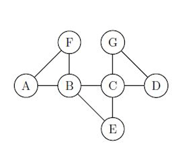{width="50%"}

    2.  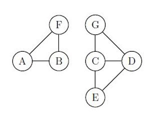{width="50%"}

    3.  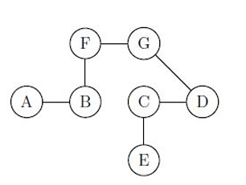{width="50%"}

    4.  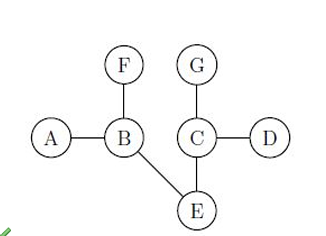{width="50%"}

    5.  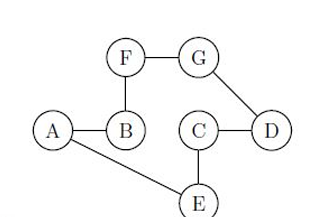{width="50%"}

    \[ans: (d)\]

21. Which of the following are valid topological orderings of the given
    DAG?

    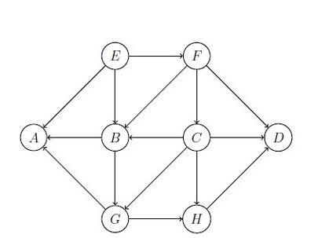{width="50%"}

    1.  E, F, C, B, G, A, H, D

    2.  E, F, B, C, G, A, H, D

    3.  E, F, C, B, G, A, H, D

    4.  E, F, C, B, G, H, D, A

    \[ans: (c), (d)\]

# Quiz 1 Sep 22 {#quiz-1-sep-22 .unnumbered}

1.  Consider a relation $R \subseteq A \times A$, where
    $A = \{1, 2, 3\}$. Given below is Table 1, in which Column A shows
    the relation and Column B shows the type of relation.

    $$\begin{array}{|l|l|}
    \hline
    \text{Relation (R) (Column A)} & \text{Type of Relation (Column B)} \\
    \hline
    R_1 = \{(1,1)\} & \text{Symmetric relation} \\
    R_2 = \{(1,1), (2,2), (3,3)\} & \text{Anti-symmetric relation} \\
    R_3 = \{(1,1), (1,2)\} & \text{Identity relation} \\
    R_4 = \{(1,3)\} & \text{Transitive relation} \\
    R_5 = \{(1,1), (2,2), (3,3), (1,2)\} & \text{Reflexive relation} \\
    R_6 = \{(1,1), (1,2), (2,1), (2,3)\} & \text{Equivalence relation} \\
    \hline
    \end{array}$$

    3.  State 'True' or 'False': $R_6$ does not match with any type of
        relations given in Column B.\
        \[ans: TRUE\]

    4.  State 'True' or 'False': $R_1$ matches with all type of
        relations except anti-symmetric relation given in Column B.\
        \[ans: FALSE\]

    5.  In total, how many relations given in Column A matches with
        transitive relation?\
        \[ans: 5\]

    6.  In total, how many relations given in Column A matches with
        reflexive relation?\
        \[ans: 2\]

2.  Consider the following relations defined on the set of integers:
    $$\begin{aligned}
    R_1 &= \{(x, y) \mid x, y \in \mathbb{Z},\ y = x^2 - 1\} \\
    R_2 &= \{(x, y) \mid x, y \in \mathbb{Z},\ |x| + |y| = 1\}
    \end{aligned}$$ Choose the correct option(s):

    1.  $R_1 \cap R_2$ represents an injective function.

    2.  $R_2$ represents a relation but not a function.

    3.  $R_1$ represents a function.

    4.  $R_2$ represents a function.

    \[ans: (b), (C)\]

3.  Let $A$ be the set of all points on the curve defined by
    $f_1(x) = -x^2 + x + 30$ and let $B$ be the set of all points on the
    curve $f_2$ defined by the reflection of $f_1$ with respect to the
    $X$-axis. If $C$ is the set of all points on the axes (i.e., $x$ and
    $y$ axes), then find the cardinality of the set $D$ where
    $D = (A \cap B) \cup (A \cap C) \cup (B \cap C)$.

    \[ans: 4\]

4.  You are climbing a ladder which is slanted at an angle of 45 degrees
    (measured in the anticlockwise direction) with respect to the
    ground. The ladder, leaning against a wall, is at a vertical
    distance of 2 metres from the ground. If you are at a location which
    cuts the ladder in the ratio 2:1 from the top to bottom, what are
    the coordinates of your location? Assume origin $(0, 0)$ to be at
    the intersection of the ladder and the ground.

    1.  $(1/2, 1/2)$

    2.  $(1/3, 1/3)$

    3.  $(2/3, 2/3)$

    4.  $(1/3, 2/3)$

    \[ans: (c)\]

5.  Sushmita was calculating SSE (sum squared error) and she found that
    SSE is a function of $a$ as follows:
    $\text{SSE} = f(a) = a^2 - 6a + 18$. What will be the best fit
    value?

    1.  $9$

    2.  $2$

    3.  $0$

    4.  $-2$

    \[ans: (a)\]

6.  Consider two quadratic functions, $p(x)$ and $q(x)$, whose
    $x$-intercepts are shown in Figure 1. The leading coefficients of
    both $p(x)$ and $q(x)$ are $1$ and the $y$-intercepts are $-27$. The
    axis of symmetry of $q(x)$ is $x = 3$, which also passes through one
    of the zeroes of $p(x)$. The line $y = d$ passes through the
    vertices of $p(x)$ and $q(x)$.

    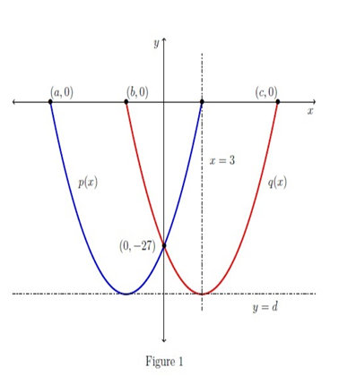{width="50%"}

    1.  Enter the value of $a$.

        \[ans: -9\]

    2.  Enter the value of $b + c + d$.

        \[ans: -30\]

    3.  Choose the set of correct option(s):

        1.  The axis of symmetry of $p(x)$ is $x = -3$.

        2.  The slopes of both $p(x)$ and $q(x)$ are same at $(0, -27)$.

        3.  The slope of $p(x)$ is $6$ but the slope $q(x)$ is $-6$ at
            $(0, -27)$.

        4.  The discriminant of both the quadratic equations $p(x) = 0$
            and $q(x) = 0$ are same.

        \[ans: (a), (c), (d)\]

7.  Ritwik wrote 12 mock tests. His score in each mock test $M(n)$ is
    represented as
    $$M(n) = -\left(\frac{n^2}{1000}\right) (n^3 - 15n^2 + 50n) + 40,$$
    where $n$ represents the mock test number, i.e.,
    $n \in \{1, 2, \ldots, 12\}$. He should score $40$ or above to pass
    the assignment.

    Based on this information, answer the given sub-questions:

    1.  How many times did Ritwik score exactly $40$?\
        \[ans: 2\]

    2.  In total, how many mock tests did Ritwik pass?\
        \[ans: 6\]

8.  Figure 2 shows the graph of a polynomial $p(x)$. Choose the set of
    correct option(s).

    {width="50%"}

    1.  The degree of $p(x)$ is at least $9$.

    2.  $p(x)$ represents an odd degree polynomial.

    3.  Total number of turning points of $p(x)$ are $9$.

    4.  Multiplicities of zero and one of the negative root could be the
        same.

    \[ans: (a), (b), (d)\]

9.  The polynomial $p(x) = a_n x^n + a_{n-1} x^{n-1} + \ldots + a_0$ has
    the following properties:

    - $p(x)$ is an even degree polynomial.

    - $p(x)$ has at least one positive real root and at least one
      negative real root.

    - $(x+4)^2$ is a factor of $p(x)$.

    - $p(0) \neq 0$

    From the options given, choose the possible representations of
    $p(x)$.

    1.  {width="50%"}

    2.  {width="50%"}

    3.  {width="50%"}

    \[ans:(a),(b),(C)\]

10. Which of the following statements is (are) correct?

    1.  $y - 6 = 3(x - 10)^2$ is an equation of a parabola whose vertex
        is at $(10, 6)$.

    2.  $p(x) = a x^5 + b x^4 + 2x + 8$ where $a = 0$ and $b \neq 0$, is
        a polynomial of degree 4.

    3.  $-5x + 4y - 1 = 0$ and $\frac{x}{4} - \frac{y}{5} = 1$ are
        perpendicular to each other.

    4.  $2x + 7y + 9 = 0$ and $6x + 21y + 9 = 0$ are parallel to each
        other.

    \[ans: (a), (b), (d)\]

# Quiz 2 Sep 22 {#quiz-2-sep-22 .unnumbered}

1.  Choose the set of correct options.

    1.  The function $f : \mathbb{R} \to \mathbb{R}$ such that
        $f(x) = x + \sqrt{x^2}$ is not onto.

    2.  The function $f(x) = x^2 - 2x + 3$ is increasing.

    3.  The function $f(x) = \dfrac{(1 + 3x^2)^2}{3x}$ is odd.

    4.  If $f$ is an invertible decreasing function, then $f^{-1}$ is
        also a decreasing function.

    \[ans: (a), (d)\]

2.  Let $f$ be a function whose domain is $[-5, 7]$. If
    $g(x) = |2x + 5|$ and $[a, b] \subset \mathbb{R}$ denotes the
    largest interval which can be a domain for the composition function
    $(f \circ g)(x)$, then the value of $a + b$ is

    \[ans: -5\]

3.  Consider two functions $f(x) = \log_2(\log_3 x)$ and
    $g(x) = -x^2 + 4x + 77$. Let $h(x) = (f \circ g)(x)$.\
    Find the maximum value of $h(x)$.\
    \[ans: 2\]

4.  Find the maximum value of $g(x)$, where $g(x) = -x^2 + 4x + 77$.\
    \[ans: 81\]

5.  Find the number of solutions of the equation $e^{2x} - 2e^x = 15$.\
    \[ans: 1\]

6.  Find the value of $x$ that satisfies the equation
    $\log_4(x-1) - \log_2(x-3) = 0$.\
    \[ans: 5\]

7.  Consider a function $f$ defined as, $$f(x) = 
    \begin{cases}
    \dfrac{1}{e^{1/x} + 1} & \text{if } x \neq 0 \\
    0 & \text{if } x = 0
    \end{cases}$$ Which of the following option(s) is(are) true?

    1.  $f$ is an unbounded function on $\mathbb{R}$.

    2.  $\displaystyle \lim_{x \to 0^-} f(x) \neq \lim_{x \to 0^+} f(x)$

    3.  $f$ is continuous at $x = 0$.

    4.  $f$ is continuous at $x = 7$.

    \[ans: (2), (4)\]

8.  Consider a sequence $(1, 2, 3, 4, 5, 6, \ldots)$, that is, $a_n = n$
    for all $n \in \mathbb{N}$. Which of the following sequences are
    subsequences of $\{a_n\}$?

    1.  $(1, 3, 1, 3, \ldots)$, that is, $b_n = 1$ if $n$ is odd and
        $b_n = 3$ if $n$ is even.

    2.  $(1, 3, 5, 7, \ldots)$, that is, $b_n = 2n - 1$ for all
        $n \in \mathbb{N}$.

    3.  $(1, 1, 2, 2, 3, 3, \ldots)$, that is, $b_n = \frac{n+1}{2}$ if
        $n$ is odd and $b_n = \frac{n}{2}$ if $n$ is even.

    4.  $(1, 8, 27, 64, \ldots)$, that is, $b_n = n^3$ for all
        $n \in \mathbb{N}$.

    \[ans: (2), (4)\]

9.  $\displaystyle \lim_{x \to 0} \frac{\sin^5(x)}{\sin(x^5)}$\
    \[ans: 1\]

10. Evaluate
    $\displaystyle \lim_{x \to 0} \frac{x + \tan(x)}{\sin(x)}$.\
    \[ans: 2\]

11. Let $\{a_n\}$ be a sequence such that
    $a_n = \dfrac{4n - 1}{3n^2 + 9}$. Find
    $\displaystyle \lim_{n \to \infty} a_n$.\
    \[ans: 0\]

12. Let $\{a_n\}$ be a sequence such that $$a_n =
    \begin{cases}
    10n + 1 + \sin(n) & \text{if $n$ is odd} \\
    \dfrac{n}{10n - 1 + \cos(n)} & \text{if $n$ is even}
    \end{cases}$$ Find $\displaystyle \lim_{n \to \infty} a_n$.\
    \[ans: 10\]

13. If $f(x) = g(x^2 + 5x) \times h(x^3 + x)$, $g'(0) = g(0) \neq 0$,
    and $h'(0) = h(0) \neq 0$, then find the value of
    $\dfrac{f'(0)}{f(0)}$.\
    \[ans: 6\]

14. Consider a function defined as, $$f(x) = 
    \begin{cases}
    mx^2 - n & x < 1 \\
    2 & x = 1 \\
    x + n & x > 1
    \end{cases}$$ If $f$ is continuous at $x = 1$, then the value of
    $m + n$ is\
    \[ans: 4\]

15. Let $f$ be a differentiable function at $x=2$. The tangent line to
    the curve represented by the function $f$ at the point $(2,6)$
    passes through the point $(4, -14)$. What will be the value of
    $f'(2)$?\
    \[ans: -10\]

# End Term Sep 22 {#end-term-sep-22 .unnumbered}

1.  Two families have decided to enter into an alliance by marriage. The
    first family has 4 sons $(S_1, S_2, S_3, S_4)$ and the second family
    has 4 daughters $(D_1, D_2, D_3, D_4)$. To avoid impropriety, the
    families insist that each one must marry someone either their own
    age, or someone one position younger or older. The graph
    representing these agreeable marriages is given below.

    {width="50%"}

    How many different acceptable marriage arrangements are possible?\
    \[ans: 5\]

2.  A company has branches in each of the six cities
    $C_1, C_2, \ldots, C_6$. The direct flight fares are as follows:\
    $(C_1, C_2, 4000)$, $(C_2, C_1, 4000)$, $(C_1, C_5, 5000)$,
    $(C_5, C_1, 5000)$, $(C_2, C_3, 5000)$, $(C_3, C_2, 5000)$,
    $(C_4, C_5, 4000)$, $(C_5, C_4, 4000)$, $(C_3, C_4, 7000)$,
    $(C_4, C_3, 7000)$, $(C_5, C_6, 1000)$, $(C_6, C_5, 1000)$,
    $(C_1, C_6, 2000)$, $(C_6, C_1, 2000)$.\
    An employee wants to travel from $C_2$ to $C_5$, travelling by the
    cheapest route possible. Find the total fare that he should pay.\
    \[ans: 7000\]

3.  Let $A$ be the set of prime numbers less than or equal to $11$.
    Consider another set $B$ which is defined as
    $B = \{x+2 \mid x \in A, x > 2\}$.Which of the following statements
    are correct?

    1.  The cardinality of the Cartesian product $A \times B$ is $25$.

    2.  The cardinality of the set $A \cup B$ is $7$.

    3.  The set $A \cap B$ is an empty set.

    4.  $R = \{(2,5),\ (5,7),\ (7,5),\ (11,13)\}$ is a relation from $A$
        to $B$.

    \[ans: (b), (d)\]

4.  Consider the universal set $U$ to be the set of all natural numbers
    less than or equal to $13$ including zero. Find the cardinality of
    the set $A \cap B^c$.

    \[ans: 7\]

5.  The polynomial $p(x) = a_n x^n + a_{n-1} x^{n-1} + \ldots + a_0$ has
    the following properties:

    - $p(x)$ is an odd degree polynomial with at least three distinct
      roots.

    - $p(x)$ has exactly two positive real roots.

    - $(x-5)^2$ is a factor of $p(x)$.

    - $p(0) \neq 0$

    Choose the best possible representations of $p(x)$.

    1.  {width="50%"}

    2.  {width="50%"}

    3.  {width="50%"}

    4.  {width="50%"}

    \[ans: (C)\]

6.  Two types of bacteria (type $A$ and type $B$) are present in a glass
    of water. Suppose $f_A(t) = 2^{(t+1)^2 - 36}$ and
    $f_B(t) = 5^{t^2 - t - 20}$, where $f_A(t)$ and $f_B(t)$ represent
    the number of bacteria of type $A$ and type $B$ at some time $t$
    respectively. At what time is the number of type $A$ bacteria equal
    to the number of type $B$ bacteria?

    \[ans: 5\]

7.  Suppose the $n$th term of a sequence $\{a_n\}$ is
    $\dfrac{2n^2 + 3n - \cos(n)}{2 - n^2}$. Let $\{b_n\}$ be another
    sequence defined as $b_n = a_n^2 + 2a_n - 5$. Find the limit of the
    sequence $\{a_n b_n\}$.

    \[ans: 10\]

8.  Consider a function $f(x)$ defined as $f(x) = |x(x-4)|$ in the
    domain $[-4,5]$. Which of the following statements are correct?

    1.  The maximum value of $f(x)$ is $32$.

    2.  The number of critical points is $5$.

    3.  The number of points where $f(x)$ is not differentiable is $2$.

    4.  The minimum value of $f(x)$ is $-1$.

    5.  The number of points where $f(x)$ attains its local maximum
        value is $3$.

    \[ans: (a), (c), (e)\]

9.  Assume that a ball was thrown from the point $(0,3)$ on the
    $XY$-plane as shown in Figure 1. The ball reaches a maximum height
    of $5$ meters and it returns to a height of $3$ m after $2$ seconds.
    Let $h(t) = a t^2 + b t + c$ be the quadratic function which
    represents the height (in meters) of the ball after $t$ seconds,
    where $a, b, c \in \mathbb{Z} \setminus \{0\}$. Find the value of
    $a-b+c$

    {width="50%"}

    \[ans: -3\]

10. Edwin plotted a graph on Desmos (an online graphing tool), which was
    continuous and differentiable at every point. Later he remembered
    the form of the function $f(x)$ that represents the graph that he
    plotted but forgot some of the values that appeared in the
    expression. So he used $m, n$ and $p$ in place of the missing values
    and the function he wrote down had the following expression:
    $$f(x) = 
    \begin{cases}
    e^{mx} + 3, & x < 0 \\
    m + 2, & x = 0 \\
    5x + p + 1, & x > 0
    \end{cases}$$ Can you help Edwin by finding the values of $m, n,$
    and $p$?

    1.  $m = 3,\, n = 5$

    2.  $m = 5,\, p = 3$

    3.  $m = 3,\, p = 4$

    4.  $m = 2,\, p = 3$

    \[ans: (b), (d)\]

11. Consider the function $f(x) = x - \dfrac{4}{x}$ on the interval
    $[2,8]$. Approximate the value of $\int_{2}^{8} 6 f(x)\, dx$ using
    the right hand Riemann sum by taking 3 sub-intervals of equal
    length.

    \[ans: 190\]

12. Find the value of the given definite integral.
    $$\int_{1}^{\infty} \frac{2\ln(x)}{x^2}\, dx$$

    \[ans: 2\]

13. Let $G$ be a simple graph with the vertex set $\{1,2,3,4,5,6\}$.
    Suppose two distinct vertices, say $i$ and $j$, of $G$ are adjacent
    if and only if $\max\{|i-j|,2\} = 2$. Find the number of edges in
    the graph $G$.

    \[ans: 9\]

14. Suppose $G$ is a graph with 6 vertices $0,1,2,3,4,5$ and the
    adjacency matrix $$\begin{bmatrix}
    0 & 1 & 0 & 0 & 0 & 0 \\
    0 & 0 & 1 & 0 & 0 & 0 \\
    0 & 0 & 0 & 1 & 0 & 0 \\
    0 & 0 & 0 & 0 & 1 & 0 \\
    0 & 0 & 0 & 0 & 0 & 1 \\
    0 & 0 & 0 & 0 & 0 & 0 \\
    \end{bmatrix}$$ Which of the following statements is INCORRECT?

    1.  The graph $G$ is a directed acyclic graph.

    2.  A possible topological sequence of the graph $G$ is
        $1, 0, 5, 2, 4, 3$.

    3.  From vertex $1$, every other vertex is reachable.

    4.  The longest path in the graph $G$ has length $5$, in terms of
        number of edges.

    \[ans: (b)\]

15. Suppose Nitya wishes to find the minimum cost spanning tree of the
    graph given below. While finding the minimum cost spanning tree she
    finds that few edge weights are missing ($x$ and $y$) but she is
    sure that the weight of the minimum cost spanning tree is $14$ in
    the graph. Which of the following are possible values for $x$ and
    $y$?

    {width="50%"}

    1.  $x = 4,\, y = 2$

    2.  $x = 4,\, y = 3$

    3.  $x = 3,\, y = 4$

    4.  $x = 1,\, y = 6$

    \[ans: (b), (d)\]

# Quiz 1 May 21 {#quiz-1-may-21 .unnumbered}

# Quiz 2 May 21 {#quiz-2-may-21 .unnumbered}

# End Term May 21 {#end-term-may-21 .unnumbered}

1.  The Ministry of Petroleum and Natural Gas estimated that $P_{0}$ is
    the number of gallons of the crude petroleum available in the
    year 2020. Consider $t=3$ as end of year 2020 and $t=4$ as the end
    of year 2021. Let $P(t)$ be the number of gallons of the same crude
    petroleum at time $t$, given by $P(t)=\log_{\frac{1}{2}}(t-k)+h$
    where $k$ and $h$ are real constants and $P(t)$ is well defined.
    According to a Petroleum Planning and Analysis Cell (PPAC) survey,
    by the end of the year 2035, all the petroleum gallons will be used
    up. Which of the following options could be correct?

    1.  $k=18-2^{h}$

    2.  $h=18-2^{k}$

    3.  $k=4, h=2$

    4.  $k=2, h=4$

    \[ans: (a), (d)\]

2.  Suppose $f(x)=\ln|x|$ is a function defined on the interval
    $(-\infty,0)\cup(0,\infty)$. For what integers values of $k$, where
    $k\in\mathbb{R}\backslash\{0\}$ satisfy the equation
    $f(k+2)=f(\frac{k-4}{k})$ are

    1.  $-4$

    2.  $-1$

    3.  $1$

    4.  $4$

    \[Ans: (a), (c)\]

3.  Consider the directed graph given below. Suppose we perform BFS/DFS
    so that when we visit a vertex, we explore its unvisited neighbours
    in a random order. Which of the following options are correct?

    1.  If we perform Depth First Search at node 0, then one of the
        possible order in which the nodes will be visited is 05142367

    2.  If we perform Depth First Search at node 0, then one of the
        possible order in which the nodes will be visited is 01453672

    3.  If we perform Breadth First Search at node 0, then one of the
        possible order in which the nodes will be visited is 01542367

    4.  If we perform Depth First Search at node 0, then one of the
        possible order in which the nodes will be visited is 01543267

4.  The domain of the function
    $f(x)=\frac{1}{\log_{10}(1-x)}+\sqrt{x+1}$ is

    1.  \* $[-1,1)$

    2.  $[-1,1)\backslash\{0\}$

    3.  \* $[-1,1]$

    4.  \* $(-1,-\infty)\cup(0,\infty)$

5.  A curious student of the IITM Online Degree Program wants to fit the
    data given in Table: 1. Using the knowledge of Maths1 course, he
    came to an understanding that the model will be of the form
    $f(x)=\log_{2}(x^{2}-4x+8)^{k}$. The student wants to calculate the
    value of $k$ such that the SSE will be minimum. What is the value of
    $k$?

    1.  1

6.  Let $A=\text{minimum}(10x^{2}-40x+50), x \in \mathbb{R}$ and
    $B=\text{minimum}(\log_{10}(10x^{2}-40x+50)), x\in\mathbb{R}$.
    Choose the correct option(s)

    1.  \* $A+B=-11$

    2.  $\log_{AB}(A-B)>0$

    3.  $\log_{A+10B}(A+B)<1$

    4.  $\log_{A+10B}(B-A)$ is not defined

7.  Choose the correct options with respect to the graph of a function
    $f(x)$ shown below.

    1.  \* The given function is invertible in the restricted domain
        (-4,0)

    2.  The given function is well defined in the restricted domain
        $(-\infty,-10]\cup[-4,0]\cup[4,\infty)$.

    3.  The range of the given function could be $(-\infty,\infty)$

    4.  The given graph is a graph of a polynomial

8.  Which of the following options is(are) CORRECT?

    1.  A graph can be drawn with 5 vertices, 5 edges, and the degree of
        each vertex being 2.

    2.  6,2,2,2,2,2,2 can be a possible listing of the degrees of a
        graph with 7 vertices.

    3.  5,5,2,2,1,1 can be a possible listing of the degrees of a graph
        with 6 vertices.

    4.  A graph can be drawn with 6 vertices, 9 edges, and the degree of
        each vertex being 3.

9.  Below table shows the adjacency list w.r.t incoming edges of a
    directed graph G. Which of the following tables shows the adjacency
    list w.r.t outgoing edges of the graph G?

    1.  (Option A table content)

    2.  \* (Option B table content)

    3.  \* (Option C table content)

    4.  (Option D table content)

10. Which of the following graphs has the smallest vertex cover?

    1.  \* (Graph A)

    2.  (Graph B)

    3.  (Graph C)

    4.  (Graph D)
